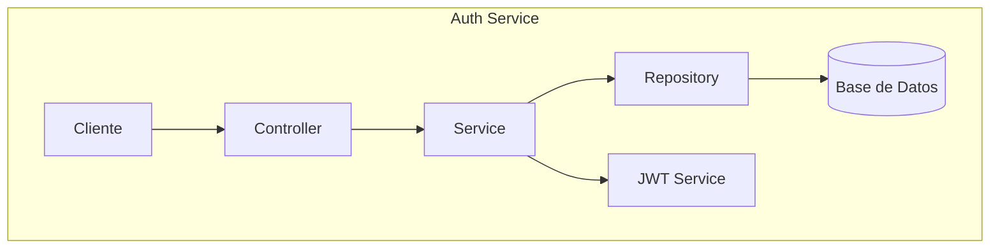
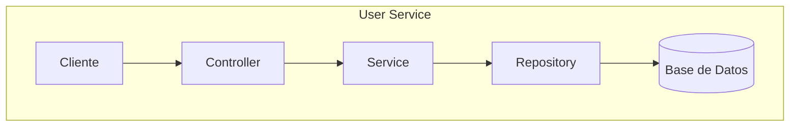
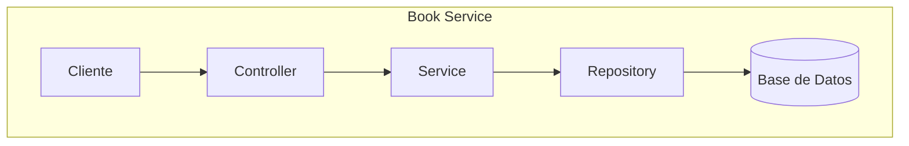
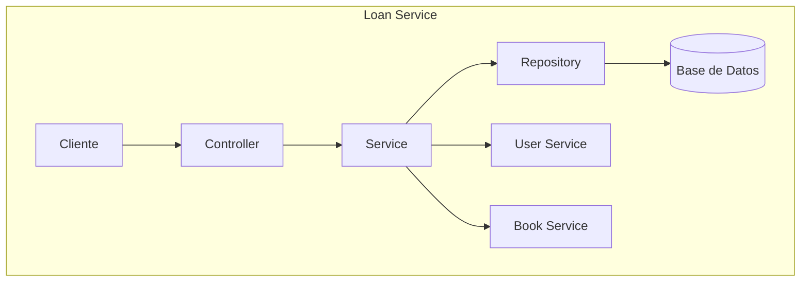
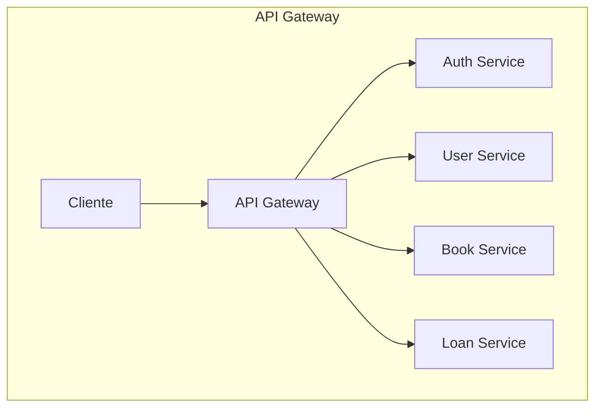
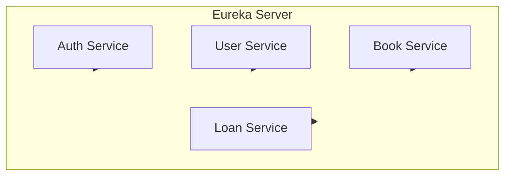
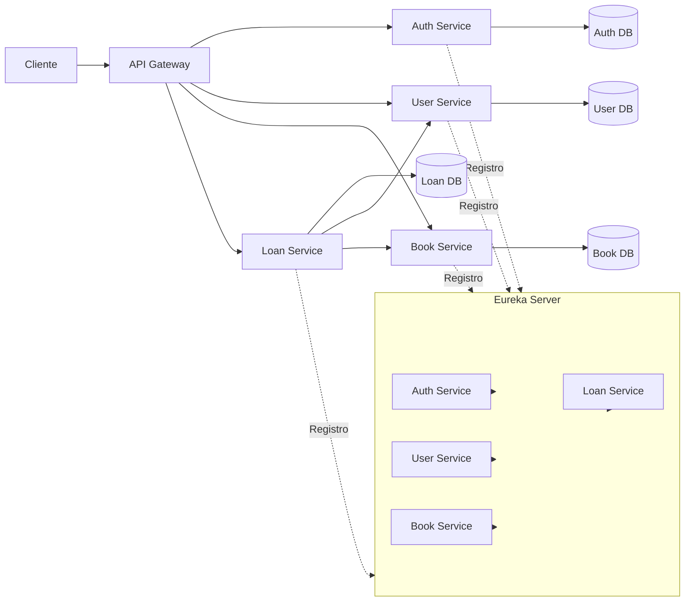

# Diagramas de Arquitectura de Microservicios

Este documento contiene los diagramas Mermaid de cada microservicio y el diagrama general del sistema. Son simples, minimalistas y listos para presentación.

## Auth Service

## User Service

## Book Service

## Loan Service

## API Gateway

## Eureka Server

## Diagrama general del sistema

