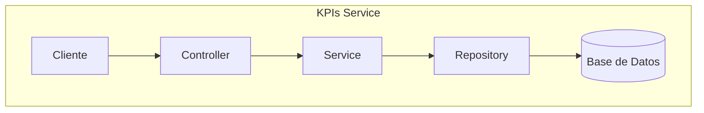

# kpis-service — Grupo Cordillera

Microservicio de indicadores de negocio (KPIs) del sistema Grupo Cordillera. Construido con **Java 25** y **Spring Boot 4**. Expone una API REST bajo `/api/kpis` que entrega datos de ventas, desempeño por sucursal, canales de venta y alertas operacionales, leyéndolos desde una base de datos PostgreSQL propia.

---

## Índice

- [kpis-service — Grupo Cordillera](#kpis-service--grupo-cordillera)
  - [Índice](#índice)
  - [1. Descripción general](#1-descripción-general)
  - [2. Stack tecnológico](#2-stack-tecnológico)
  - [3. Estructura del proyecto](#3-estructura-del-proyecto)
  - [4. Configuración](#4-configuración)
    - [Variables de entorno](#variables-de-entorno)
    - [Puertos](#puertos)
  - [5. Base de datos y migraciones](#5-base-de-datos-y-migraciones)
    - [Migraciones](#migraciones)
    - [Tablas](#tablas)
  - [6. Arquitectura interna — Patrón Strategy](#6-arquitectura-interna--patrón-strategy)
    - [Flujo de una petición](#flujo-de-una-petición)
    - [`KpiType` (enum)](#kpitype-enum)
    - [Implementaciones de Strategy](#implementaciones-de-strategy)
    - [Agregar un nuevo KPI](#agregar-un-nuevo-kpi)
  - [7. Endpoints](#7-endpoints)
    - [`GET /health`](#get-health)
    - [`GET /summary`](#get-summary)
    - [`GET /sales/monthly`](#get-salesmonthly)
    - [`GET /branches/performance`](#get-branchesperformance)
    - [`GET /channels`](#get-channels)
    - [`GET /alerts`](#get-alerts)
    - [`GET /{type}`](#get-type)
  - [8. Tests](#8-tests)
  - [9. Ejecución local sin Docker](#9-ejecución-local-sin-docker)
  - [10. Dockerfile](#10-dockerfile)
  - [11. Rol en el monorepo](#11-rol-en-el-monorepo)

---

## 1. Descripción general

`kpis-service` provee todos los datos que el dashboard de `front-web2` necesita para mostrar indicadores de negocio. En el flujo de la aplicación:

1. El frontend solicita datos al **BFF** (`bff-service`).
2. El BFF llama a los endpoints de `kpis-service` en la red interna de Docker.
3. `kpis-service` consulta su base de datos PostgreSQL y retorna los datos como JSON.

El servicio implementa el **patrón Strategy** para encapsular cada tipo de KPI en una clase independiente, facilitando agregar nuevos indicadores sin modificar el código existente.

---

## 2. Stack tecnológico

| Componente           | Versión  | Uso                                                       |
|----------------------|----------|-----------------------------------------------------------|
| Java                 | 25 LTS   | Lenguaje del servicio                                     |
| Spring Boot          | 4.0.6    | Framework principal, autoconfiguracion, servidor embebido |
| Spring Web MVC       | —        | API REST, `@RestController`, `ResponseEntity`             |
| Spring JDBC          | —        | Acceso a la base de datos con `JdbcTemplate`              |
| Flyway               | —        | Migraciones de base de datos                              |
| PostgreSQL           | 16       | Base de datos relacional                                  |
| JUnit 5 + Mockito    | —        | Pruebas unitarias                                         |
| Maven                | 3.9+     | Gestor de dependencias y build                            |
| Docker (multi-stage) | —        | Imagen de producción                                      |

---

## 3. Estructura del proyecto

```
kpis-service/
├── Dockerfile
├── pom.xml
├── README.md
└── src/
    ├── main/
    │   ├── java/com/grupocordillera/kpis/
    │   │   ├── KpisServiceApplication.java          ← Punto de entrada Spring Boot
    │   │   ├── config/
    │   │   │   └── WebConfig.java                   ← Configuración CORS
    │   │   ├── controller/
    │   │   │   ├── KpiController.java               ← Endpoints REST /api/kpis
    │   │   │   └── RestExceptionHandler.java        ← Manejo global de errores
    │   │   ├── dto/
    │   │   │   ├── KpiSummaryResponse.java          ← DTO resumen general
    │   │   │   ├── MonthlySalesResponse.java        ← DTO ventas mensuales
    │   │   │   ├── BranchPerformanceResponse.java   ← DTO desempeño sucursales
    │   │   │   ├── SalesChannelResponse.java        ← DTO canales de venta
    │   │   │   └── AlertResponse.java               ← DTO alertas
    │   │   ├── model/
    │   │   │   ├── KpiType.java                     ← Enum de tipos de KPI
    │   │   │   └── AlertStatus.java                 ← Enum de estado de alerta
    │   │   ├── repository/
    │   │   │   └── InMemoryKpiRepository.java       ← Repositorio con datos en memoria
    │   │   └── service/
    │   │       ├── KpiQueryService.java             ← Orquestador de strategies
    │   │       ├── factory/
    │   │       │   └── KpiStrategyFactory.java      ← Fábrica de strategies
    │   │       └── strategy/
    │   │           ├── KpiStrategy.java             ← Interfaz genérica
    │   │           ├── SummaryKpiStrategy.java
    │   │           ├── MonthlySalesStrategy.java
    │   │           ├── BranchPerformanceStrategy.java
    │   │           ├── SalesChannelStrategy.java
    │   │           └── AlertsStrategy.java
    │   └── resources/
    │       ├── application.properties
    │       └── db/migration/
    │           ├── V1__create_kpis_schema.sql
    │           ├── V2__seed_kpis_data.sql
    │           └── V3__upsert_kpis_seed_data.sql
    └── test/
        └── java/com/grupocordillera/kpis/
            ├── KpisServiceApplicationTests.java
            ├── controller/
            │   └── KpiControllerTest.java
            ├── repository/
            │   └── InMemoryKpiRepositoryTest.java
            └── service/factory/
                └── KpiStrategyFactoryTest.java
```

---

## 4. Configuración

Archivo: `src/main/resources/application.properties`

```properties
spring.application.name=kpis-service
server.port=8081

spring.datasource.url=${SPRING_DATASOURCE_URL:jdbc:postgresql://localhost:5434/kpis_db}
spring.datasource.username=${SPRING_DATASOURCE_USERNAME:kpis_user}
spring.datasource.password=${SPRING_DATASOURCE_PASSWORD:kpis_pass}

spring.flyway.enabled=true
spring.flyway.locations=classpath:db/migration
```

### Variables de entorno

| Variable                     | Descripción                    | Valor por defecto                           |
|------------------------------|--------------------------------|---------------------------------------------|
| `SPRING_DATASOURCE_URL`      | URL JDBC de la base de datos   | `jdbc:postgresql://localhost:5434/kpis_db`  |
| `SPRING_DATASOURCE_USERNAME` | Usuario de la base de datos    | `kpis_user`                                 |
| `SPRING_DATASOURCE_PASSWORD` | Contraseña de la base de datos | `kpis_pass`                                 |

### Puertos

| Contexto           | Puerto           |
|--------------------|------------------|
| Ejecución directa  | `localhost:8081` |
| Docker Compose     | `localhost:9081` (mapeado de `9081:8081`) |

## Diagrama de Arquitectura



---

## 5. Base de datos y migraciones

- **Motor**: PostgreSQL 16
- **Base de datos**: `kpis_db`
- **Usuario**: `kpis_user`
- **Contenedor Docker**: `grupo-cordillera-kpis-db` (puerto host: `5434`)

Flyway gestiona el esquema automáticamente al arrancar. Los scripts deben seguir el formato `V{N}__{descripcion}.sql`.

### Migraciones

| Script                        | Descripción                                              |
|-------------------------------|----------------------------------------------------------|
| `V1__create_kpis_schema.sql`  | Crea las tablas: `kpi_summary`, `monthly_sales`, `branch_performance`, `sales_channels`, `alerts` |
| `V2__seed_kpis_data.sql`      | Inserta datos iniciales de KPIs                          |
| `V3__upsert_kpis_seed_data.sql` | Actualiza o inserta datos de seed (usa `ON CONFLICT`)  |

### Tablas

| Tabla                | Datos que almacena                                 |
|----------------------|----------------------------------------------------|
| `kpi_summary`        | Ventas totales, margen, stock crítico, reclamos, ticket promedio, satisfacción |
| `monthly_sales`      | Ventas y target por mes                            |
| `branch_performance` | Ventas, meta y cumplimiento por sucursal           |
| `sales_channels`     | Participación de ventas por canal (tienda, web, etc.) |
| `alerts`             | Alertas operacionales con nivel y estado           |

> **Importante**: nunca modifiques un script ya aplicado. Crea siempre una nueva migración con el siguiente número de versión.

---

## 6. Arquitectura interna — Patrón Strategy

El servicio implementa el **patrón Strategy** para desacoplar la obtención de cada tipo de KPI. Esto permite agregar nuevos indicadores sin modificar el controlador ni el servicio orquestador.

### Flujo de una petición

```
KpiController
    │  llama a
    ▼
KpiQueryService
    │  pide la estrategia a
    ▼
KpiStrategyFactory
    │  resuelve según KpiType y retorna
    ▼
KpiStrategy<T>  (implementación concreta, ej. SummaryKpiStrategy)
    │  consulta datos en
    ▼
InMemoryKpiRepository  →  PostgreSQL (via JdbcTemplate)
```

### `KpiType` (enum)

```
SUMMARY | MONTHLY_SALES | BRANCH_PERFORMANCE | SALES_CHANNELS | ALERTS
```

### Implementaciones de Strategy

| Clase                        | `KpiType`           | Retorna                        |
|------------------------------|---------------------|--------------------------------|
| `SummaryKpiStrategy`         | `SUMMARY`           | `KpiSummaryResponse`           |
| `MonthlySalesStrategy`       | `MONTHLY_SALES`     | `List<MonthlySalesResponse>`   |
| `BranchPerformanceStrategy`  | `BRANCH_PERFORMANCE`| `List<BranchPerformanceResponse>` |
| `SalesChannelStrategy`       | `SALES_CHANNELS`    | `List<SalesChannelResponse>`   |
| `AlertsStrategy`             | `ALERTS`            | `List<AlertResponse>`          |

### Agregar un nuevo KPI

1. Agregar el valor al enum `KpiType`.
2. Crear el DTO de respuesta.
3. Implementar `KpiStrategy<T>` en una nueva clase con `@Component`.
4. El `KpiStrategyFactory` la detectará automáticamente vía inyección de dependencias.
5. (Opcional) Agregar un endpoint dedicado en `KpiController`.

---

## 7. Endpoints

Base URL: `http://localhost:9081/api/kpis` (Docker) / `http://localhost:8081/api/kpis` (local)

---

### `GET /health`

Verifica que el servicio esté activo.

**Respuesta `200 OK`**:
```json
{ "status": "UP", "service": "kpis-service" }
```

---

### `GET /summary`

Resumen general de los indicadores de negocio.

**Respuesta `200 OK`**:
```json
{
  "ventasTotales": 1250000,
  "margenUtilidad": 34.5,
  "stockCritico": 12,
  "reclamosActivos": 5,
  "ticketPromedio": 87500,
  "satisfaccionCliente": 92.3
}
```

---

### `GET /sales/monthly`

Ventas mensuales con target para comparación.

**Respuesta `200 OK`**:
```json
[
  { "mes": "Enero", "ventas": 980000, "target": 1000000 },
  { "mes": "Febrero", "ventas": 1100000, "target": 1050000 }
]
```

---

### `GET /branches/performance`

Desempeño de ventas por sucursal.

**Respuesta `200 OK`**:
```json
[
  { "sucursal": "Santiago Centro", "ventas": 450000, "meta": 420000, "cumplimiento": 107.1 },
  { "sucursal": "Providencia", "ventas": 380000, "meta": 400000, "cumplimiento": 95.0 }
]
```

---

### `GET /channels`

Participación de ventas por canal de venta.

**Respuesta `200 OK`**:
```json
[
  { "canal": "Tienda física", "porcentaje": 55.0 },
  { "canal": "Web", "porcentaje": 30.0 },
  { "canal": "Telefónico", "porcentaje": 15.0 }
]
```

---

### `GET /alerts`

Alertas operacionales activas o resueltas.

**Respuesta `200 OK`**:
```json
[
  { "id": 1, "mensaje": "Stock crítico en producto X", "nivel": "ALTO", "estado": "ACTIVA" },
  { "id": 2, "mensaje": "Reclamo sin respuesta", "nivel": "MEDIO", "estado": "ACTIVA" }
]
```

---

### `GET /{type}`

Endpoint genérico que acepta cualquier valor del enum `KpiType`.

**Ejemplo**: `GET /SUMMARY` → equivalente a `GET /summary`

---

## 8. Tests

Los tests se ubican en `src/test/java/com/grupocordillera/kpis/`.

| Clase                       | Qué prueba                                                      |
|-----------------------------|-----------------------------------------------------------------|
| `KpisServiceApplicationTests` | Que el contexto de Spring Boot carga correctamente            |
| `KpiControllerTest`         | Respuestas HTTP correctas para cada endpoint del controlador    |
| `InMemoryKpiRepositoryTest` | Que el repositorio retorna los datos esperados                  |
| `KpiStrategyFactoryTest`    | Que la fábrica resuelve la estrategia correcta por `KpiType`    |

Ejecutar todos los tests:

```bash
mvn test
```

Ejecutar una clase específica:

```bash
mvn test -Dtest=KpiControllerTest
```

---

## 9. Ejecución local sin Docker

Requisitos: Java 25, Maven 3.9+, PostgreSQL corriendo en `localhost:5434` con la base `kpis_db`.

```bash
cd kpis-service
mvn spring-boot:run
```

O compilar y ejecutar el JAR:

```bash
mvn clean package -DskipTests
java -jar target/kpis-service-*.jar
```

Con variables de entorno personalizadas:

```bash
SPRING_DATASOURCE_URL=jdbc:postgresql://localhost:5434/kpis_db \
SPRING_DATASOURCE_USERNAME=kpis_user \
SPRING_DATASOURCE_PASSWORD=kpis_pass \
mvn spring-boot:run
```

---

## 10. Dockerfile

El Dockerfile usa **multi-stage build**:

1. **Stage build** (`maven:3.9.11-eclipse-temurin-25`): compila el proyecto con Maven y genera el JAR.
2. **Stage runtime** (`eclipse-temurin:25-jre`): copia solo el JAR final y lo ejecuta.

Esto mantiene la imagen de producción liviana, sin incluir Maven ni el código fuente.

---

## 11. Rol en el monorepo

```
front-web2  →  bff-service  →  kpis-service  →  kpis-db (PostgreSQL)
```

- `kpis-service` **solo recibe peticiones del BFF**.
- Comparte el `docker-compose.yml` raíz con `auth-service`, `bff-service` y `front-web2`.
- Su base de datos `kpis-db` es **completamente independiente** de `auth-db`.

