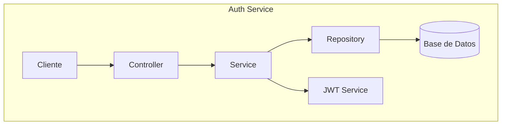

# Auth Service

## 1. Nombre y Descripción del Microservicio

**Auth Service** es un microservicio especializado en gestión de autenticación y autorización de usuarios para la plataforma Grupo Cordillera. Proporciona funcionalidades esenciales de registro, autenticación y perfil de usuario mediante una API REST.

## 2. Objetivo del Servicio

Centralizar la lógica de autenticación y validación de usuarios, permitiendo que otros microservicios y aplicaciones frontend verifiquen identidades de forma segura y consistente. El servicio actúa como la fuente única de verdad para la información de usuarios en el ecosistema.

## 3. Tecnologías Utilizadas

| Tecnología | Versión | Propósito |
|-----------|---------|----------|
| Java | 17 LTS | Lenguaje de programación |
| Spring Boot | 3.3.5 | Framework web y aplicaciones backend |
| Maven | 3.9.9 | Gestor de dependencias y construcción |
| JUnit 5 | (Spring Boot starter) | Testing y pruebas unitarias |
| Docker | Latest | Containerización de la aplicación |
| Eclipse Temurin | 17 JRE | Entorno de ejecución Java |

## 4. Arquitectura y Estructura de Carpetas

```
auth-service/
├── src/
│   ├── main/
│   │   ├── java/com/grupocordillera/authService/
│   │   │   ├── AuthServiceApplication.java          # Punto de entrada de Spring Boot
│   │   │   ├── config/                              # Configuración de beans y componentes
│   │   │   ├── controller/
│   │   │   │   └── UserController.java              # REST endpoints
│   │   │   ├── dto/                                 # Data Transfer Objects
│   │   │   │   ├── UserDto.java                     # DTO para registro/login
│   │   │   │   └── UserProfileDto.java              # DTO para perfil de usuario
│   │   │   ├── model/
│   │   │   │   └── User.java                        # Modelo de dominio
│   │   │   ├── repository/
│   │   │   │   └── InMemoryUserRepository.java      # Persistencia en memoria
│   │   │   └── service/
│   │   │       └── UserService.java                 # Lógica de negocio
│   │   └── resources/
│   │       └── application.properties               # Configuración de aplicación
│   └── test/
│       └── java/com/grupocordillera/authService/   # Pruebas unitarias e integración
├── target/                                          # Artefactos compilados
├── Dockerfile                                       # Configuración de containerización
└── pom.xml                                          # Configuración de Maven
```

### Patrón Arquitectónico

El servicio implementa el patrón **Layered Architecture** (Arquitectura en Capas):

- **Presentation Layer**: `UserController` - Gestiona solicitudes HTTP
- **Business Logic Layer**: `UserService` - Contiene reglas de negocio
- **Persistence Layer**: `InMemoryUserRepository` - Acceso a datos
- **Domain Layer**: `User` - Modelos de negocio

## 5. Requisitos Previos

### Para desarrollo local:
- Java 17 LTS o superior instalado
- Maven 3.6+ instalado
- IDE recomendada: IntelliJ IDEA o VS Code con extensiones Java

### Verificar instalación:
```bash
java -version
mvn -version
```

### Para Docker:
- Docker Desktop instalado
- Acceso a Docker Hub

## 6. Instalación

### Opción A: Desarrollo Local

1. **Clonar/navegar al repositorio:**
```bash
cd auth-service
```

2. **Instalar dependencias y compilar:**
```bash
mvn clean install
```

3. **Compilar únicamente (sin tests):**
```bash
mvn clean compile
```

### Opción B: Con Docker

```bash
docker build -t grupo-cordillera/auth-service:latest .
```

## 7. Variables de Entorno

| Variable | Valor por Defecto | Descripción |
|----------|------------------|-------------|
| `spring.application.name` | `auth-service` | Nombre de la aplicación |
| `server.port` | `8080` | Puerto en el que escucha el servicio |

**Archivo de configuración:** `src/main/resources/application.properties`

Para ambiente de producción, crear `application-prod.properties`:

# Auth Service - Grupo Cordillera

## 1. Descripcion general

`auth-service` es el microservicio encargado de la autenticacion y gestion basica de usuarios del sistema Grupo Cordillera.

Esta construido con Java 25 LTS y Spring Boot 4.0.6. Expone una API REST bajo el prefijo `/api/auth`, valida credenciales, permite registrar usuarios, entrega perfiles de usuario y mantiene una lista de usuarios en memoria para fines de desarrollo y demostracion.

Dentro del monorepo, este servicio se conecta con:

- `front-web2`: aplicacion React/Vite que muestra el login y el dashboard.
- `bff-service`: Backend For Frontend en Node.js/Express que actua como proxy entre el frontend y los microservicios.
- `docker-compose.yml`: orquestacion local de `auth-service`, `kpis-service`, `bff-service` y `front-web2`.

En la arquitectura Docker actual, `front-web2` no llama directamente a `auth-service`. El navegador llama a `bff-service` en `http://localhost:8000/api/auth`, y el BFF reenvia la peticion al contenedor `auth-service` en `http://auth-service:8080/api/auth`.

## 2. Stack tecnologico

### Runtime y framework

- **Java 25 LTS**: version del lenguaje definida en `pom.xml`.
- **Spring Boot 4.0.6**: framework principal para levantar la aplicacion, configurar beans y exponer endpoints REST. Se usa esta version porque declara compatibilidad con Java 25.
- **Spring Web MVC**: incluido por `spring-boot-starter-web`; permite usar `@RestController`, `@RequestMapping`, `@GetMapping`, `@PostMapping`, `ResponseEntity` y conversion JSON automatica.
- **Maven**: gestor de dependencias y build del proyecto.

### Testing

- **spring-boot-starter-test**: dependencia de pruebas. Incluye JUnit 5, AssertJ, Mockito y utilidades de testing de Spring.
- **JUnit 5**: usado directamente en `UserServiceTest`.

### Contenedores

- **Docker multi-stage build**:
  - Primer stage: `maven:3.9.11-eclipse-temurin-25`, compila el JAR.
  - Segundo stage: `eclipse-temurin:25-jre`, ejecuta el JAR final.

## 3. Estructura del proyecto

```text
auth-service/
|-- Dockerfile
|-- pom.xml
|-- README.md
`-- src/
    |-- main/
    |   |-- java/com/grupocordillera/authService/
    |   |   |-- AuthServiceApplication.java
    |   |   |-- config/
    |   |   |   `-- WebConfig.java
    |   |   |-- controller/
    |   |   |   `-- UserController.java
    |   |   |-- dto/
    |   |   |   |-- UserDto.java
    |   |   |   `-- UserProfileDto.java
    |   |   |-- model/
    |   |   |   `-- User.java
    |   |   |-- repository/
    |   |   |   `-- InMemoryUserRepository.java
    |   |   `-- service/
    |   |       `-- UserService.java
    |   `-- resources/
    |       `-- application.properties
    `-- test/
        `-- java/com/grupocordillera/authService/service/
            `-- UserServiceTest.java
```

## 4. Configuracion

El archivo `src/main/resources/application.properties` define:


```properties
spring.application.name=auth-service
server.port=8080
```

## Diagrama de Arquitectura



Para más diagramas del conjunto de microservicios, ver `ARCHITECTURE_DIAGRAMS.md`.

## 8. Cómo Ejecutar Localmente

### Iniciar el servicio en modo desarrollo:

```bash
mvn spring-boot:run
```

El servicio estará disponible en: `http://localhost:8080`

### Verificar que el servicio está activo:

```bash
curl http://localhost:8080/api/auth/health
```

**Respuesta esperada:**
```json
{
  "status": "UP",
  "service": "auth-service"
}
```

## 9. Cómo Ejecutar con Docker

### Construcción:
```bash
docker build -t auth-service:latest .
```

### Ejecución:
```bash
docker run -d \
  --name auth-service \
  -p 9080:8080 \
  auth-service:latest
```

### Con docker-compose (desde raíz del proyecto):
```bash
docker-compose up -d auth-service
```

El servicio estará disponible en: `http://localhost:9080`

## 10. Endpoints y Funcionalidades Principales

### Endpoints de Autenticación

| Método | Ruta | Descripción | Autenticación |
|--------|------|-------------|---------------|
| `GET` | `/api/auth/health` | Health check del servicio | No |
| `POST` | `/api/auth/login` | Autenticar usuario | No |
| `POST` | `/api/auth/register` | Registrar nuevo usuario | No |
| `GET` | `/api/auth/users/me` | Obtener perfil actual | No (mock) |
| `GET` | `/api/auth/users/mock` | Obtener usuario mock por rol | No |
| `GET` | `/api/auth/users` | Listar todos los usuarios | No |

### Detalle de Endpoints

#### 1. **POST /api/auth/login**

Autentica un usuario con credenciales.

**Request:**
```json
{
  "username": "vendedor",
  "password": "1234"
}
```

**Response (200 OK):**
```json
{
  "message": "Autenticacion exitosa",
  "username": "vendedor"
}
```

**Response (401 Unauthorized):**
```json
{
  "error": "Credenciales invalidas"
}
```

#### 2. **POST /api/auth/register**

Registra un nuevo usuario en el sistema.

**Request:**
```json
{
  "username": "nuevo_usuario",
  "email": "usuario@example.com",
  "password": "micontraseña",
  "role": "Vendedor"
}
```

**Response (201 Created):**
```json
{
  "message": "Usuario registrado correctamente",
  "email": "usuario@example.com",
  "username": "nuevo_usuario",
  "role": "Vendedor"
}
```

**Response (400 Bad Request):**
```json
{
  "error": "El usuario ya existe"
}
```

#### 3. **GET /api/auth/users/mock?role=Vendedor**

Obtiene un usuario de demostración según el rol especificado.

**Roles disponibles:**
- `Gerente`
- `Supervisor`
- `Vendedor`

**Response (200 OK):**
```json
{
  "username": "vendedor",
  "fullname": "Vendedor",
  "role": "Vendedor",
  "email": "vendedor@cordillera.cl",
  "avatar": "vendedor"
}
```

#### 4. **GET /api/auth/users**

Lista todos los usuarios registrados en el sistema.

**Response (200 OK):**
```json
[
  {
    "username": "gerente",
    "email": "gerente@cordillera.cl",
    "password": "1234",
    "role": "Gerente"
  },
  {
    "username": "supervisor",
    "email": "supervisor@cordillera.cl",
    "password": "1234",
    "role": "Supervisor"
  }
]
```

## 11. Flujo de Comunicación con Otros Microservicios

```
Frontend (front-web2)
        ↓
   BFF Service
        ↓
Auth Service (este servicio)
        ↓
Repository (InMemoryUserRepository)
```

### Secuencia de Autenticación:

1. **Frontend** envía credenciales a **BFF** en `POST /api/auth/login`
2. **BFF** reenvía la solicitud a **Auth Service** en `POST /api/auth/login`
3. **Auth Service** valida credenciales contra `InMemoryUserRepository`
4. Se retorna respuesta de éxito o error
5. **BFF** envía respuesta al **Frontend**
6. **Frontend** almacena sesión en `sessionStorage`

### Integración con KPIs Service:

El Auth Service no consume directamente KPIs Service, pero comparte el mismo patrón de arquitectura y es consumido a través del BFF.

## 12. Ejemplos de Uso

### Ejemplo 1: Flujo completo de login

```bash
# 1. Iniciar el servicio
mvn spring-boot:run

# 2. Enviar solicitud de login
curl -X POST http://localhost:8080/api/auth/login \
  -H "Content-Type: application/json" \
  -d '{
    "username": "vendedor",
    "password": "1234"
  }'

# Respuesta:
# {"message":"Autenticacion exitosa","username":"vendedor"}
```

### Ejemplo 2: Registrar nuevo usuario

```bash
curl -X POST http://localhost:8080/api/auth/register \
  -H "Content-Type: application/json" \
  -d '{
    "username": "newuser",
    "email": "newuser@example.com",
    "password": "securepass123",
    "role": "Vendedor"
  }'
```

### Ejemplo 3: Obtener usuarios mock por rol

```bash
curl "http://localhost:8080/api/auth/users/mock?role=Gerente"
```

### Ejemplo 4: Listar todos los usuarios

```bash
curl http://localhost:8080/api/auth/users
```

## 13. Scripts Disponibles

En `pom.xml` están configurados los siguientes commandos Maven:

| Comando | Descripción |
|---------|-------------|
| `mvn clean` | Limpia el directorio target |
| `mvn compile` | Compila el código fuente |
| `mvn test` | Ejecuta pruebas unitarias |
| `mvn package` | Genera JAR ejecutable |
| `mvn clean package` | Limpia y genera JAR |
| `mvn spring-boot:run` | Ejecuta la aplicación en desarrollo |
| `mvn dependency:tree` | Visualiza árbol de dependencias |

## 14. Buenas Prácticas Implementadas

### 1. **Inyección de Dependencias**
- Uso de Spring Dependency Injection para desacoplamiento
- Constructor injection en lugar de field injection

### 2. **Patrones de Diseño**
- **Repository Pattern**: Abstracción de acceso a datos
- **Layered Architecture**: Separación clara de responsabilidades
- **DTO Pattern**: Transfer Objects para desacoplamiento

### 3. **Validación de Datos**
- Validación en DTOs y modelos
- Manejo consistente de errores y excepciones

### 4. **Control de Errores**
- Códigos HTTP apropiados (201, 400, 401)
- Respuestas de error estructuradas

### 5. **Seguridad Básica**
- Normalización de entrada (trim, toLowerCase)
- Validación de roles permitidos

### 6. **Testing**
- Tests unitarios para capas de servicio y repositorio
- Pruebas de controlador REST

### 7. **Configuración Externalizada**
- `application.properties` para configuración
- Facilita diferentes ambientes (dev, test, prod)

## 15. Posibles Mejoras Futuras

### Corto Plazo:
1. **Autenticación JWT**: Implementar tokens JWT para mejor seguridad
2. **Encriptación de contraseñas**: Usar BCrypt en lugar de almacenar en texto plano
3. **Base de datos persistente**: Migrar de InMemory a PostgreSQL/MySQL
4. **Validación mejorada**: Añadir Bean Validation (Jakarta Validation)
5. **Logging estructurado**: Implementar SLF4J con Logback

### Mediano Plazo:
6. **Autorización por roles**: Implementar Spring Security con @PreAuthorize
7. **Refresh tokens**: Sistema de renovación de tokens
8. **Auditoría**: Registrar cambios de usuarios y accesos
9. **Métricas**: Integrar Micrometer y Prometheus
10. **OpenAPI/Swagger**: Documentar API automáticamente

### Largo Plazo:
11. **OAuth 2.0**: Soporte para autenticación federada
12. **Multi-factor authentication**: 2FA, autenticación biométrica
13. **Rate limiting**: Protección contra ataques de fuerza bruta
14. **Caching**: Redis para sesiones distribuidas
15. **Microservicios avanzados**: Integración con circuit breakers

## 16. Autores e Integrantes

**Proyecto**: Grupo Cordillera - Evaluación Parcial N°2  
**Asignatura**: DSY1106 - Desarrollo Fullstack III  
**Institución**: Duoc UC  
**Equipo**: [Integrantes del equipo]  
**Fecha**: Mayo 2026

## 17. Licencia

Este proyecto es parte de una evaluación académica en Duoc UC. Se permite su uso con fines educativos bajo consentimiento del equipo y la institución.

---

### Documentación Complementaria

- [Swagger/OpenAPI](./docs/swagger.yml) - Especificación OpenAPI (por implementar)
- [Guía de Desarrollo](./docs/DEVELOPMENT.md) - Guía para desarrolladores (por crear)
- [Changelog](./CHANGELOG.md) - Historial de cambios (por crear)

### Soporte y Contacto

Para reportar problemas o sugerencias, crear un issue en el repositorio del proyecto.

**Estado**: En desarrollo  
**Versión**: 0.0.1-SNAPSHOT  
**Última actualización**: Mayo 2026
