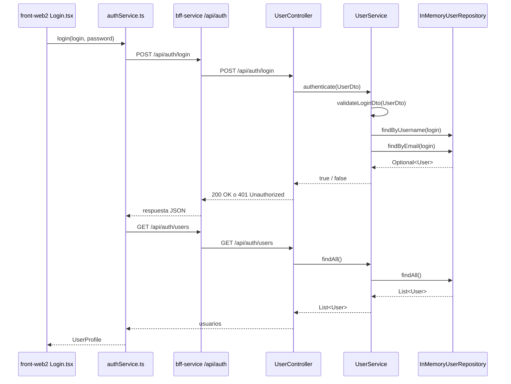
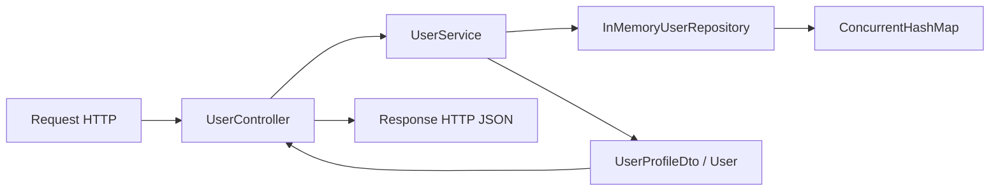
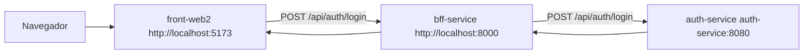

# Auth Service - Grupo Cordillera

## 1. Descripcion general

`auth-service` es el microservicio encargado de la autenticacion y gestion basica de usuarios del sistema Grupo Cordillera.

Esta construido con Java 25 LTS y Spring Boot 4.0.6. Expone una API REST bajo el prefijo `/api/auth`, valida credenciales, permite registrar usuarios, entrega perfiles de usuario y mantiene una lista de usuarios en memoria para fines de desarrollo y demostracion.

Dentro del monorepo, este servicio se conecta con:

- `front-web2`: aplicacion React/Vite que muestra el login y el dashboard.
- `bff-service`: Backend For Frontend en Node.js/Express que actua como proxy entre el frontend y los microservicios.
- `docker-compose.yml`: orquestacion local de `auth-service`, `kpis-service`, `bff-service` y `front-web2`.

En la arquitectura Docker actual, `front-web2` no llama directamente a `auth-service`. El navegador llama a `bff-service` en `http://localhost:8000/api/auth`, y el BFF reenvia la peticion al contenedor `auth-service` en `http://auth-service:8080/api/auth`.

## 2. Stack tecnologico

### Runtime y framework

- **Java 25 LTS**: version del lenguaje definida en `pom.xml`.
- **Spring Boot 4.0.6**: framework principal para levantar la aplicacion, configurar beans y exponer endpoints REST. Se usa esta version porque declara compatibilidad con Java 25.
- **Spring Web MVC**: incluido por `spring-boot-starter-web`; permite usar `@RestController`, `@RequestMapping`, `@GetMapping`, `@PostMapping`, `ResponseEntity` y conversion JSON automatica.
- **Maven**: gestor de dependencias y build del proyecto.

### Testing

- **spring-boot-starter-test**: dependencia de pruebas. Incluye JUnit 5, AssertJ, Mockito y utilidades de testing de Spring.
- **JUnit 5**: usado directamente en `UserServiceTest`.

### Contenedores

- **Docker multi-stage build**:
  - Primer stage: `maven:3.9.11-eclipse-temurin-25`, compila el JAR.
  - Segundo stage: `eclipse-temurin:25-jre`, ejecuta el JAR final.

## 3. Estructura del proyecto

```text
auth-service/
|-- Dockerfile
|-- pom.xml
|-- README.md
`-- src/
    |-- main/
    |   |-- java/com/grupocordillera/authService/
    |   |   |-- AuthServiceApplication.java
    |   |   |-- config/
    |   |   |   `-- WebConfig.java
    |   |   |-- controller/
    |   |   |   `-- UserController.java
    |   |   |-- dto/
    |   |   |   |-- UserDto.java
    |   |   |   `-- UserProfileDto.java
    |   |   |-- model/
    |   |   |   `-- User.java
    |   |   |-- repository/
    |   |   |   `-- InMemoryUserRepository.java
    |   |   `-- service/
    |   |       `-- UserService.java
    |   `-- resources/
    |       `-- application.properties
    `-- test/
        `-- java/com/grupocordillera/authService/service/
            `-- UserServiceTest.java
```

## 4. Configuracion

El archivo `src/main/resources/application.properties` define:

```properties
spring.application.name=auth-service
server.port=8080
```

Esto significa que, ejecutado directamente, el servicio escucha en:

```text
http://localhost:8080
```

Con Docker Compose, el puerto interno `8080` se publica en el host como `9080`:

```yaml
auth-service:
  ports:
    - "9080:8080"
```

Por eso, usando Docker Compose, se puede acceder al servicio directo desde:

```text
http://localhost:9080/api/auth
```

Sin embargo, el frontend usa normalmente el BFF:

```text
http://localhost:8000/api/auth
```

## 5. Librerias y dependencias

El `pom.xml` declara dos dependencias principales.

### `spring-boot-starter-web`

Incluye las piezas necesarias para crear una API REST:

- Servidor embebido.
- Spring MVC.
- Serializacion y deserializacion JSON con Jackson.
- Anotaciones REST como `@RestController`, `@RequestBody` y `@RequestParam`.

En este proyecto se usa para:

- Exponer endpoints en `UserController`.
- Recibir JSON desde `front-web2` o `bff-service`.
- Devolver respuestas JSON con `ResponseEntity` y `Map`.

### `spring-boot-starter-test`

Incluye herramientas para pruebas automatizadas:

- JUnit 5.
- Mockito.
- AssertJ.
- Spring Test.

En este proyecto se usa JUnit 5 para probar la logica de `UserService`, especialmente registro, validaciones y autenticacion.

## 6. Componentes principales

### `AuthServiceApplication`

Archivo de entrada de la aplicacion.

Responsabilidad:

- Ejecutar `SpringApplication.run(...)`.
- Activar la autoconfiguracion de Spring Boot mediante `@SpringBootApplication`.
- Permitir que Spring escanee componentes dentro del paquete `com.grupocordillera.authService`.

### `WebConfig`

Clase de configuracion web.

Responsabilidad:

- Configurar CORS para rutas `/api/**`.
- Permitir llamadas desde `http://localhost:5173`.
- Permitir metodos `GET` y `POST`.

Codigo relevante:

```java
registry.addMapping("/api/**")
        .allowedOrigins("http://localhost:5173")
        .allowedMethods("GET", "POST");
```

Esta configuracion es util cuando `front-web2` llama directo al backend. En Docker, el frontend normalmente llama al BFF y el BFF tambien tiene su propia configuracion CORS.

### `UserController`

Controlador REST del servicio.

Responsabilidad:

- Definir los endpoints publicos de autenticacion y usuarios.
- Recibir solicitudes HTTP.
- Delegar la logica de negocio a `UserService`.
- Traducir resultados y errores a respuestas HTTP.

No contiene reglas complejas de negocio. Esa separacion mantiene el controlador enfocado en la capa HTTP.

### `UserService`

Capa de servicio y logica de negocio.

Responsabilidad:

- Registrar usuarios.
- Validar datos de entrada.
- Autenticar por username o email.
- Validar roles permitidos.
- Construir perfiles de usuario.
- Consultar usuarios desde el repositorio.

Roles permitidos:

```java
Gerente
Supervisor
Vendedor
```

### `InMemoryUserRepository`

Repositorio en memoria.

Responsabilidad:

- Guardar usuarios en un `ConcurrentHashMap`.
- Buscar usuarios por username.
- Buscar usuarios por email.
- Validar existencia de username o email.
- Inicializar usuarios mock con `@PostConstruct`.

Usuarios iniciales:

| Username | Email | Password | Role |
| --- | --- | --- | --- |
| `gerente` | `gerente@cordillera.cl` | `1234` | `Gerente` |
| `supervisor` | `supervisor@cordillera.cl` | `1234` | `Supervisor` |
| `vendedor` | `vendedor@cordillera.cl` | `1234` | `Vendedor` |

Nota: al ser un repositorio en memoria, los datos se pierden al reiniciar la aplicacion.

### `User`

Modelo de dominio simple.

Campos:

- `username`
- `password`
- `email`
- `role`

Actualmente no usa JPA ni anotaciones de persistencia porque no existe base de datos conectada.

### `UserDto`

DTO de entrada para login y registro.

Campos:

- `email`
- `username`
- `password`
- `role`

Uso:

- En `POST /api/auth/register`, se usan los cuatro campos.
- En `POST /api/auth/login`, se usan `username` y `password`. El campo `username` puede contener el username real o el email del usuario.

### `UserProfileDto`

DTO de salida para perfil de usuario.

Es un `record` de Java:

```java
public record UserProfileDto(
        String id,
        String name,
        String role,
        String email,
        String username
) {
}
```

Este contrato coincide con lo que espera `front-web2` en su tipo `UserProfile`.

## 7. Endpoints

Todos los endpoints estan bajo:

```text
/api/auth
```

### `GET /api/auth/health`

Verifica que el servicio este levantado.

Respuesta:

```json
{
  "status": "UP",
  "service": "auth-service"
}
```

### `POST /api/auth/register`

Registra un usuario nuevo en memoria.

Request:

```json
{
  "email": "usuario@mail.com",
  "username": "usuario",
  "password": "1234",
  "role": "Gerente"
}
```

Respuesta exitosa `201 Created`:

```json
{
  "message": "Usuario registrado correctamente",
  "email": "usuario@mail.com",
  "username": "usuario",
  "role": "Gerente"
}
```

Errores posibles `400 Bad Request`:

- `El cuerpo de la solicitud es obligatorio`
- `El email es obligatorio`
- `El email no es valido`
- `El role es obligatorio`
- `El role debe ser Gerente, Supervisor o Vendedor`
- `El username es obligatorio`
- `La password es obligatoria`
- `El usuario ya existe`
- `El email ya existe`

### `POST /api/auth/login`

Autentica un usuario por username o email.

Request con username:

```json
{
  "username": "gerente",
  "password": "1234"
}
```

Request con email:

```json
{
  "username": "gerente@cordillera.cl",
  "password": "1234"
}
```

Respuesta exitosa `200 OK`:

```json
{
  "message": "Autenticacion exitosa",
  "username": "gerente"
}
```

Respuesta con credenciales invalidas `401 Unauthorized`:

```json
{
  "error": "Credenciales invalidas"
}
```

Errores de validacion `400 Bad Request`:

- `El cuerpo de la solicitud es obligatorio`
- `El username es obligatorio`
- `La password es obligatoria`

### `GET /api/auth/users`

Lista todos los usuarios registrados en memoria.

Respuesta:

```json
[
  {
    "username": "gerente",
    "password": "1234",
    "email": "gerente@cordillera.cl",
    "role": "Gerente"
  }
]
```

Importante: este endpoint expone `password`. Esta bien para una demo academica o mock local, pero no es seguro para un entorno real.

### `GET /api/auth/users/me`

Retorna un perfil de usuario actual.

Comportamiento actual:

- Toma el primer usuario disponible en memoria.
- Si no hay usuarios, retorna un perfil de invitado.
- No usa token ni sesion backend.

Respuesta:

```json
{
  "id": "gerente",
  "name": "gerente",
  "role": "Gerente",
  "email": "gerente@cordillera.cl",
  "username": "gerente"
}
```

### `GET /api/auth/users/mock?role=gerente`

Retorna un perfil mock segun rol.

Roles soportados:

- `gerente`
- `supervisor`
- `vendedor`

Ejemplo:

```text
GET /api/auth/users/mock?role=gerente
```

Respuesta:

```json
{
  "id": "mock-gerente",
  "name": "Carolina Munoz",
  "role": "Gerente",
  "email": "carolina.munoz@grupocordillera.cl",
  "username": "cmunoz"
}
```

Si el rol no es valido:

```json
{
  "error": "El role debe ser Gerente, Supervisor o Vendedor"
}
```

## 8. Flujo interno de autenticacion



## 9. Conexion con `front-web2`

### Variable de entorno del frontend

`front-web2` consume el backend de usuarios mediante:

```ts
const AUTH_API_URL = import.meta.env.VITE_USERS_API_URL;
```

En Docker Compose se configura asi:

```yaml
front-web:
  build:
    context: ./front-web2
    args:
      VITE_USERS_API_URL: http://localhost:8000/api/auth
```

Por eso, desde el navegador:

```text
front-web2 -> http://localhost:8000/api/auth -> bff-service -> auth-service
```

### Servicio frontend: `authService.ts`

Archivo:

```text
front-web2/src/services/authService.ts
```

Responsabilidad:

- Enviar credenciales a `POST {VITE_USERS_API_URL}/login`.
- Leer el error del backend si la respuesta falla.
- Si el login es correcto, consultar `GET {VITE_USERS_API_URL}/users`.
- Buscar el usuario autenticado por email o username.
- Convertir el usuario backend al tipo `UserProfile`.

Funcion principal:

```ts
authService.login(login: string, password: string): Promise<UserProfile>
```

### Componente frontend: `Login.tsx`

Archivo:

```text
front-web2/src/components/Login.tsx
```

Responsabilidad:

- Mostrar formulario de inicio de sesion.
- Validar que usuario/correo y password no esten vacios.
- Llamar a `authService.login(...)`.
- Mostrar errores devueltos por el backend.
- Enviar el usuario autenticado a `App.tsx` mediante `onLogin`.

### Estado de sesion en `front-web2`

Archivo:

```text
front-web2/src/utils/session-utils.ts
```

Cuando el login es exitoso:

1. `Login.tsx` llama a `onLogin(user)`.
2. `App.tsx` ejecuta `saveSessionUser(authenticatedUser)`.
3. El usuario se guarda en `sessionStorage` bajo la clave:

```text
grupo-cordillera-user
```

No existe JWT ni cookie de sesion. La "sesion" actual es solo estado local del navegador.

### Contrato compartido de usuario

Backend devuelve `UserProfileDto`:

```java
id
name
role
email
username
```

Frontend espera `UserProfile`:

```ts
export interface UserProfile {
  id: string;
  name: string;
  role: string;
  email?: string;
  username?: string;
  avatarUrl?: string;
}
```

Los campos principales coinciden. `avatarUrl` existe solo en frontend como campo opcional.

## 10. Rol del BFF

`bff-service` centraliza las llamadas del frontend.

Configuracion en Docker Compose:

```yaml
bff-service:
  environment:
    PORT: 8000
    AUTH_API_URL: http://auth-service:8080/api/auth
    KPIS_API_URL: http://kpis-service:8081/api/kpis
    ALLOWED_ORIGINS: http://localhost:5173
```

Proxy de auth en `bff-service/src/index.js`:

```js
app.use('/api/auth', forward(AUTH_API_URL));
```

Esto significa que:

```text
POST http://localhost:8000/api/auth/login
```

se reenvia internamente a:

```text
POST http://auth-service:8080/api/auth/login
```

El BFF evita que el frontend tenga que conocer los puertos internos o nombres de contenedores de cada microservicio.

## 11. Patrones de diseno y arquitectura

### Arquitectura por capas

El servicio separa responsabilidades en capas:

- **Controller**: capa HTTP.
- **Service**: reglas de negocio.
- **Repository**: acceso a datos en memoria.
- **DTOs**: contratos de entrada y salida.
- **Model**: estructura de dominio.

Flujo:



Beneficios:

- El controlador no queda cargado con reglas de negocio.
- Las validaciones viven en el servicio.
- El repositorio puede reemplazarse por base de datos mas adelante.
- Los DTOs protegen el contrato HTTP de cambios internos del modelo.

### Dependency Injection

Spring inyecta dependencias por constructor:

```java
public UserController(UserService userService) {
    this.userService = userService;
}
```

```java
public UserService(InMemoryUserRepository userRepository) {
    this.userRepository = userRepository;
}
```

Beneficios:

- Facilita pruebas.
- Evita crear dependencias manualmente con `new` dentro de los componentes.
- Permite que Spring controle el ciclo de vida de los beans.

### Repository Pattern

`InMemoryUserRepository` encapsula el almacenamiento de usuarios.

Aunque hoy usa `ConcurrentHashMap`, el resto de la aplicacion no necesita saber ese detalle. Si mas adelante se reemplaza por JPA, una base de datos o una API externa, el impacto deberia concentrarse en la capa repository.

### DTO Pattern

`UserDto` y `UserProfileDto` separan el contrato HTTP del modelo interno `User`.

Uso actual:

- `UserDto`: entrada para login y registro.
- `UserProfileDto`: salida para perfiles usados por el frontend.

### Fail-fast validation

`UserService` valida las entradas antes de ejecutar la accion.

Ejemplos:

- Si el body es nulo, lanza error.
- Si falta username/password, lanza error.
- Si el email no contiene `@`, lanza error.
- Si el role no pertenece al set permitido, lanza error.

Esto evita estados invalidos y hace que el controlador pueda responder con `400 Bad Request`.

### Mock / In-memory repository

El proyecto usa datos en memoria para simplificar el desarrollo local.

Ventajas:

- No requiere base de datos.
- Es rapido para demos y pruebas.
- Facilita levantar todo con Docker Compose.

Limitaciones:

- Los datos no persisten al reiniciar.
- No hay cifrado de passwords.
- No es adecuado para produccion.

## 12. Seguridad actual y limitaciones

Este servicio implementa autenticacion basica para desarrollo, pero no una seguridad productiva.

Limitaciones importantes:

- Las passwords se guardan en texto plano.
- `GET /api/auth/users` expone passwords.
- No hay JWT.
- No hay cookies seguras.
- No hay Spring Security.
- No hay roles/autorizacion por endpoint.
- `GET /api/auth/users/me` no identifica al usuario real autenticado.
- El login devuelve solo `message` y `username`, no un token ni un perfil completo.
- CORS esta limitado a `http://localhost:5173`.

Recomendaciones para evolucion:

- Incorporar `spring-boot-starter-security`.
- Guardar passwords con BCrypt.
- Devolver JWT o usar cookies HTTP-only.
- Proteger `/users` para que no exponga informacion sensible.
- Reemplazar `InMemoryUserRepository` por una base de datos.
- Crear un endpoint `/users/me` real basado en token.
- Devolver el perfil completo en `/login` para evitar que el frontend tenga que llamar luego a `/users`.

## 13. Pruebas

Archivo:

```text
src/test/java/com/grupocordillera/authService/service/UserServiceTest.java
```

Casos cubiertos:

- Registro exitoso.
- Error por username duplicado.
- Login exitoso con username.
- Login fallido por password incorrecta.
- Login exitoso con email.
- Error por email duplicado.
- Error por rol invalido.

Comando:

```bash
mvn test
```

Desde la raiz del monorepo:

```bash
cd auth-service
mvn test
```

## 14. Ejecucion local

### Ejecutar con Maven

```bash
cd auth-service
mvn spring-boot:run
```

URL:

```text
http://localhost:8080/api/auth/health
```

### Ejecutar tests

```bash
cd auth-service
mvn test
```

### Construir JAR

```bash
cd auth-service
mvn clean package
```

JAR generado:

```text
target/auth-service-0.0.1-SNAPSHOT.jar
```

### Ejecutar JAR

```bash
java -jar target/auth-service-0.0.1-SNAPSHOT.jar
```

## 15. Docker

Construir imagen:

```bash
cd auth-service
docker build -t grupo-cordillera-auth .
```

Ejecutar contenedor:

```bash
docker run --rm -p 9080:8080 grupo-cordillera-auth
```

Probar health:

```bash
curl http://localhost:9080/api/auth/health
```

## 16. Docker Compose del monorepo

Desde la raiz:

```bash
docker compose up --build
```

Servicios principales:

| Servicio | URL host | URL interna |
| --- | --- | --- |
| `front-web2` | `http://localhost:5173` | `front-web:80` |
| `bff-service` | `http://localhost:8000` | `bff-service:8000` |
| `auth-service` | `http://localhost:9080` | `auth-service:8080` |
| `kpis-service` | `http://localhost:9081` | `kpis-service:8081` |

Flujo de login con Docker:



## 17. Ejemplos de uso

### Health

```bash
curl http://localhost:9080/api/auth/health
```

### Login directo contra auth-service en Docker

```bash
curl -X POST http://localhost:9080/api/auth/login ^
  -H "Content-Type: application/json" ^
  -d "{\"username\":\"gerente\",\"password\":\"1234\"}"
```

En PowerShell:

```powershell
Invoke-RestMethod `
  -Method Post `
  -Uri "http://localhost:9080/api/auth/login" `
  -ContentType "application/json" `
  -Body '{"username":"gerente","password":"1234"}'
```

### Login via BFF

```powershell
Invoke-RestMethod `
  -Method Post `
  -Uri "http://localhost:8000/api/auth/login" `
  -ContentType "application/json" `
  -Body '{"username":"gerente","password":"1234"}'
```

### Registro

```powershell
Invoke-RestMethod `
  -Method Post `
  -Uri "http://localhost:9080/api/auth/register" `
  -ContentType "application/json" `
  -Body '{"email":"nuevo@cordillera.cl","username":"nuevo","password":"1234","role":"Vendedor"}'
```

## 18. Como cambiar la integracion con el frontend

### Caso actual

`front-web2` hace:

```text
POST {VITE_USERS_API_URL}/login
GET  {VITE_USERS_API_URL}/users
```

Con Docker Compose:

```text
VITE_USERS_API_URL=http://localhost:8000/api/auth
```

### Si se quiere llamar directo a auth-service

En desarrollo local se podria configurar:

```env
VITE_USERS_API_URL=http://localhost:8080/api/auth
```

O usando Docker:

```env
VITE_USERS_API_URL=http://localhost:9080/api/auth
```

En ese caso, CORS de `auth-service` debe permitir el origen del frontend.

### Mejora recomendada

Actualmente el frontend hace login y luego consulta `/users` para obtener el rol. Una mejor alternativa seria que `POST /login` devuelva directamente el perfil completo:

```json
{
  "message": "Autenticacion exitosa",
  "user": {
    "id": "gerente",
    "name": "gerente",
    "role": "Gerente",
    "email": "gerente@cordillera.cl",
    "username": "gerente"
  }
}
```

Con eso:

- `front-web2` dejaria de consultar `GET /users`.
- No seria necesario exponer passwords.
- El contrato de login quedaria mas cercano a una autenticacion real.

## 19. Como reemplazar el repositorio en memoria por base de datos

Pasos sugeridos:

1. Crear una interfaz `UserRepository` con metodos como `save`, `findByUsername`, `findByEmail`, `existsByUsername`, `existsByEmail` y `findAll`.
2. Renombrar `InMemoryUserRepository` a `InMemoryUserRepositoryImpl`.
3. Crear una implementacion JPA si se agrega base de datos.
4. Modificar `UserService` para depender de la interfaz y no de la clase concreta.
5. Convertir `User` en entidad JPA si corresponde.
6. Agregar migraciones o esquema de base de datos.

Esto reforzaria el Repository Pattern y reduciria el acoplamiento de `UserService`.

## 20. Resumen de responsabilidades

| Archivo | Responsabilidad |
| --- | --- |
| `AuthServiceApplication.java` | Punto de entrada Spring Boot |
| `WebConfig.java` | Configuracion CORS |
| `UserController.java` | API REST y respuestas HTTP |
| `UserService.java` | Reglas de negocio, validaciones y autenticacion |
| `InMemoryUserRepository.java` | Persistencia temporal en memoria |
| `User.java` | Modelo de usuario |
| `UserDto.java` | DTO de entrada para login/registro |
| `UserProfileDto.java` | DTO de salida para perfiles |
| `UserServiceTest.java` | Pruebas unitarias de logica de negocio |
| `Dockerfile` | Build y runtime del contenedor |

## 21. Puntos clave para explicar el proyecto

- `auth-service` es un microservicio REST de autenticacion hecho con Spring Boot.
- La aplicacion sigue una arquitectura por capas: controller, service, repository, DTO y model.
- Los usuarios se guardan en memoria usando `ConcurrentHashMap`.
- El login acepta username o email en el campo `username`.
- Los roles validos son `Gerente`, `Supervisor` y `Vendedor`.
- `front-web2` consume la API usando `VITE_USERS_API_URL`.
- En Docker, `front-web2` llama al BFF en `localhost:8000`, no directo al puerto `9080`.
- El BFF reenvia `/api/auth/*` hacia `auth-service`.
- La sesion del frontend se guarda en `sessionStorage`, no en el backend.
- La implementacion actual es adecuada para desarrollo/demo, pero no para produccion sin agregar seguridad real.
