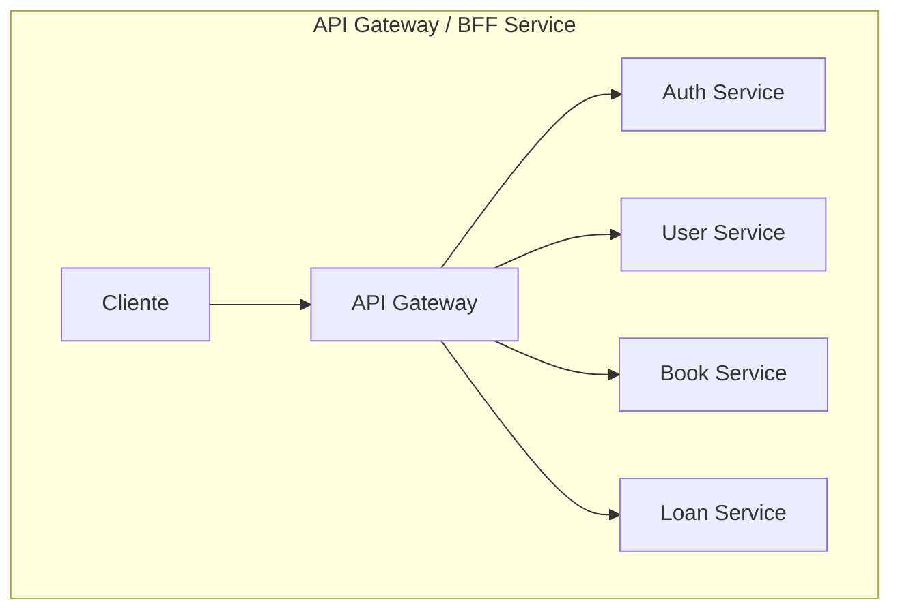

# BFF Service (Backend For Frontend)

## 1. Nombre y Descripción del Microservicio

**BFF Service** (Backend For Frontend) es un intermediario estratégico entre la aplicación frontend y los microservicios backend en Grupo Cordillera. Actúa como una capa de abstracción que orquesta llamadas a múltiples servicios, normaliza respuestas y proporciona un único punto de entrada para el cliente web.

## 2. Objetivo del Servicio

Centralizar la lógica de orquestación de API, reducir la complejidad del frontend al exponer una interfaz simplificada, gestionar CORS, y optimizar la comunicación entre la aplicación web y los servicios backend. Implementa el patrón BFF (Backend For Frontend) para mejorar experiencia de desarrollo y rendimiento.

## 3. Tecnologías Utilizadas

| Tecnología | Versión | Propósito |
|-----------|---------|----------|
| Node.js | 22 (Alpine) | Runtime de JavaScript |
| Express.js | 5.1.0 | Framework HTTP/REST |
| CORS | 2.8.5 | Middleware para Cross-Origin requests |
| dotenv | 16.6.1 | Gestión de variables de entorno |
| Jest | 30.4.2 | Framework de testing |
| Supertest | 7.2.2 | HTTP assertion library para tests |
| Docker | Latest | Containerización |
| Node Alpine | 22 | Imagen base liviana |

## 4. Arquitectura y Estructura de Carpetas

```
bff-service/
├── src/
│   ├── index.js                          # Configuración de Express y middleware
│   ├── server.js                         # Punto de entrada del servidor
│   └── (Estructura modular a expandir)
│       ├── routes/                       # Rutas de API (por implementar)
│       ├── middleware/                   # Middlewares personalizados (por implementar)
│       └── services/                     # Servicios de orquestación (por implementar)
├── test/
│   └── app.test.js                       # Pruebas unitarias
├── package.json                          # Dependencias y scripts
├── package-lock.json                     # Lock de dependencias
├── .env                                  # Variables de entorno (local)
├── .env.example                          # Plantilla de variables
├── Dockerfile                            # Configuración Docker
├── .dockerignore                         # Archivos a ignorar en Docker
└── babel.config.js                       # Configuración de Babel (si aplica)
```

### Patrón Arquitectónico

El BFF implementa el patrón **API Gateway with Orchestration**:

```
┌─────────────────┐
│   Frontend      │
└────────┬────────┘
         │ HTTP/REST
         ▼
┌──────────────────────────────┐
│     BFF Service              │
│  ┌────────────────────────┐  │
│  │ Request Router         │  │
│  └────────┬───────────────┘  │
│           │                   │
│  ┌────────▼──────┐  ┌──────────────┐
│  │Auth Service   │  │KPIs Service  │
│  └────────────────┘  └──────────────┘
│                                      │
└──────────────────────────────────────┘
```

## 5. Requisitos Previos

### Para desarrollo local:
- Node.js 20+ instalado (recomendado: 22)
- npm 10+ o yarn
- IDE: VS Code, WebStorm o similar

### Verificar instalación:
```bash
node --version
npm --version
```

### Para Docker:
- Docker Desktop instalado
- Acceso a registry

## 6. Instalación

### Opción A: Desarrollo Local

1. **Navegar al directorio del servicio:**
```bash
cd bff-service
```

2. **Instalar dependencias:**
```bash
npm install
# o
npm ci  # para instalación reproducible
```

3. **Configurar variables de entorno:**
```bash
cp .env.example .env
# Editar .env con valores específicos del ambiente
```

### Opción B: Con Docker

```bash
docker build -t grupo-cordillera/bff-service:latest .
```

## 7. Variables de Entorno

| Variable | Valor por Defecto | Descripción |
|----------|------------------|-------------|
| `PORT` | `8000` | Puerto en el que escucha el BFF |
| `AUTH_API_URL` | `http://localhost:8080/api/auth` | URL base del servicio de autenticación |
| `KPIS_API_URL` | `http://localhost:8081/api/kpis` | URL base del servicio de KPIs |
| `ALLOWED_ORIGINS` | `http://localhost:5173` | Orígenes permitidos para CORS (separados por comas) |
| `NODE_ENV` | `development` | Ambiente (development, production, test) |

### Archivo `.env` ejemplo:

```env
PORT=8000
AUTH_API_URL=http://auth-service:8080/api/auth
KPIS_API_URL=http://kpis-service:8081/api/kpis
ALLOWED_ORIGINS=http://localhost:5173,https://app.example.com
NODE_ENV=development
```

### En Docker (docker-compose.yml):

```yaml
environment:
  PORT: 8000
  AUTH_API_URL: http://auth-service:8080/api/auth
  KPIS_API_URL: http://kpis-service:8081/api/kpis
  ALLOWED_ORIGINS: http://localhost:5173
```

## 8. Cómo Ejecutar Localmente

### Modo Desarrollo (con Hot Reload):

```bash
npm run dev
```

Salida esperada:
```
bff-service running on http://localhost:8000
```

### Modo Producción:

```bash
npm start
```

### Verificar que el servicio está activo:

```bash
curl http://localhost:8000/health
```

**Respuesta esperada:**
```json
{
  "status": "UP",
  "service": "bff-service"
}
```

## Diagrama de Arquitectura



Para más diagramas del conjunto de microservicios, ver `ARCHITECTURE_DIAGRAMS.md`.

## 9. Cómo Ejecutar con Docker

### Construcción:
```bash
docker build -t bff-service:latest .
```

### Ejecución:
```bash
docker run -d \
  --name bff-service \
  -p 8000:8000 \
  -e PORT=8000 \
  -e AUTH_API_URL=http://auth-service:8080/api/auth \
  -e KPIS_API_URL=http://kpis-service:8081/api/kpis \
  -e ALLOWED_ORIGINS=http://localhost:5173 \
  bff-service:latest
```

### Con docker-compose:
```bash
# Desde la raíz del proyecto
docker-compose up -d bff-service
```

El servicio estará disponible en: `http://localhost:8000`

## 10. Endpoints y Funcionalidades Principales

### Endpoints de BFF

| Método | Ruta | Descripción |
|--------|------|-------------|
| `GET` | `/health` | Health check del BFF |
| `GET` | `/api/dashboard` | Obtiene datos agregados de dashboard |
| `*` | `/api/auth/*` | Proxy a Auth Service |
| `*` | `/api/kpis/*` | Proxy a KPIs Service |

### Detalle de Endpoints

#### 1. **GET /health**

Health check del BFF Service.

**Response (200 OK):**
```json
{
  "status": "UP",
  "service": "bff-service"
}
```

#### 2. **GET /api/dashboard**

Orquesta múltiples llamadas a KPIs Service y retorna datos agregados de dashboard.

**Response (200 OK):**
```json
{
  "summary": {
    "totalSales": 1250000,
    "activeUsers": 45,
    "conversionRate": 0.85
  },
  "sales": [
    {
      "month": "Enero",
      "amount": 100000
    },
    {
      "month": "Febrero",
      "amount": 125000
    }
  ],
  "branches": [
    {
      "name": "Sucursal Centro",
      "sales": 500000
    }
  ],
  "channels": [
    {
      "name": "Online",
      "revenue": 600000
    }
  ],
  "alerts": [
    {
      "severity": "high",
      "message": "Ventas por debajo de meta"
    }
  ]
}
```

**Response (502 Bad Gateway):**
```json
{
  "error": "Error consultando servicios internos",
  "status": 503
}
```

#### 3. **Proxy: /api/auth/***

Todas las rutas bajo `/api/auth/` se reenvían a Auth Service.

**Ejemplos:**
- `POST /api/auth/login` → `POST http://AUTH_API_URL/login`
- `POST /api/auth/register` → `POST http://AUTH_API_URL/register`
- `GET /api/auth/users` → `GET http://AUTH_API_URL/users`

#### 4. **Proxy: /api/kpis/***

Todas las rutas bajo `/api/kpis/` se reenvían a KPIs Service.

**Ejemplos:**
- `GET /api/kpis/summary` → `GET http://KPIS_API_URL/summary`
- `GET /api/kpis/sales/monthly` → `GET http://KPIS_API_URL/sales/monthly`
- `GET /api/kpis/alerts` → `GET http://KPIS_API_URL/alerts`

## 11. Flujo de Comunicación con Otros Microservicios

```
Frontend (HTTP Request)
          ↓
    BFF Service
    /           \
   ↓             ↓
Auth Service   KPIs Service
   ↓             ↓
    \           /
      ↓ ↓ ↓ ↓ ↓
    Response agregado
          ↓
Frontend (JSON Response)
```

### Secuencia de Autenticación:

1. Frontend realiza `POST /api/auth/login`
2. BFF recibe solicitud en middleware `forward(AUTH_API_URL)`
3. BFF reenvía a `http://auth-service:8080/api/auth/login`
4. Auth Service procesa y responde
5. BFF envía respuesta al Frontend

### Secuencia de Dashboard:

1. Frontend realiza `GET /api/dashboard`
2. BFF ejecuta `Promise.all()` con 5 endpoints de KPIs:
   - `/summary`
   - `/sales/monthly`
   - `/branches/performance`
   - `/channels`
   - `/alerts`
3. KPIs Service responde a cada endpoint
4. BFF agrega respuestas en un único objeto
5. Frontend recibe datos completos

## 12. Ejemplos de Uso

### Ejemplo 1: Health Check

```bash
curl http://localhost:8000/health
```

### Ejemplo 2: Login a través del BFF

```bash
curl -X POST http://localhost:8000/api/auth/login \
  -H "Content-Type: application/json" \
  -d '{
    "username": "vendedor",
    "password": "1234"
  }'
```

### Ejemplo 3: Obtener Dashboard Completo

```bash
curl http://localhost:8000/api/dashboard
```

### Ejemplo 4: Listar usuarios a través del BFF

```bash
curl http://localhost:8000/api/auth/users
```

### Ejemplo 5: Obtener KPIs de resumen

```bash
curl http://localhost:8000/api/kpis/summary
```

### Ejemplo 6: Llamada desde Frontend (fetch)

```javascript
// Login
const loginResponse = await fetch('/api/auth/login', {
  method: 'POST',
  headers: { 'Content-Type': 'application/json' },
  body: JSON.stringify({ username: 'vendedor', password: '1234' })
});

// Dashboard
const dashboardResponse = await fetch('/api/dashboard');
const dashboardData = await dashboardResponse.json();
console.log(dashboardData);
```

## 13. Scripts Disponibles

| Comando | Descripción |
|---------|-------------|
| `npm run dev` | Ejecuta en modo desarrollo con hot reload (Node --watch) |
| `npm start` | Ejecuta en modo producción |
| `npm test` | Ejecuta pruebas unitarias con Jest |
| `npm run test:watch` | Ejecuta pruebas en modo watch |
| `npm install` | Instala dependencias |
| `npm ci` | Instalación limpia reproducible |
| `npm audit` | Verifica vulnerabilidades en dependencias |
| `npm outdated` | Verifica paquetes desactualizados |

## 14. Buenas Prácticas Implementadas

### 1. **Proxy Pattern**
- Implementación de función `proxyRequest()` reutilizable
- Manejo genérico de métodos HTTP y headers

### 2. **Middleware CORS**
- Whitelist de orígenes permitidos configurable
- Previene acceso no autorizado de orígenes

### 3. **Gestión de Errores**
- Middleware centralizado de manejo de errores
- Respuestas estructuradas con estados HTTP apropiados

### 4. **Orquestación de Datos**
- `Promise.all()` para paralelismo en dashboard
- Manejo de fallos parciales

### 5. **Headers Personalizados**
- Preservación de Content-Type en proxies
- Construcción dinámica de headers

### 6. **Variables de Entorno**
- dotenv para configuración externalizada
- Valores por defecto sensatos

### 7. **Logging**
- `console.error()` para errores
- Mensajes descriptivos en errores

### 8. **Seguridad**
- CORS configurado restrictivamente
- Validación de Content-Type

### 9. **Testing**
- Pruebas unitarias con Jest
- Supertest para HTTP assertions

## 15. Posibles Mejoras Futuras

### Corto Plazo:
1. **Rate Limiting**: Express-rate-limit para proteger contra abuse
2. **Caching**: Redis para cachear respuestas frecuentes
3. **Validación de requests**: express-validator para DTO validation
4. **Logging estructura**: Winston o Pino para logs estructurados
5. **Request/Response timing**: Middleware para medir latencia

### Mediano Plazo:
6. **Circuit Breaker**: Implementar patrón circuit breaker para resilencia
7. **Retry logic**: Reintentos automáticos en fallos transitorios
8. **Compresión**: gzip/brotli para compresión de respuestas
9. **API Versioning**: Soporte para múltiples versiones de API
10. **Documentación OpenAPI**: Auto-generación de Swagger

### Largo Plazo:
11. **GraphQL**: Alternativa a REST con query optimization
12. **WebSocket**: Soporte para real-time bidirectional
13. **Métricas**: Prometheus/Grafana para monitoreo
14. **Trazabilidad distribuida**: OpenTelemetry/Jaeger
15. **Message Queue**: Kafka/RabbitMQ para eventos asíncronos

## 16. Autores e Integrantes

**Proyecto**: Grupo Cordillera - Evaluación Parcial N°2  
**Asignatura**: DSY1106 - Desarrollo Fullstack III  
**Institución**: Duoc UC  
**Equipo**: [Integrantes del equipo]  
**Fecha**: Mayo 2026

## 17. Licencia

Este proyecto es parte de una evaluación académica en Duoc UC. Se permite su uso con fines educativos bajo consentimiento del equipo y la institución.

---

### Documentación Complementaria

- [Guía de Configuración](./docs/CONFIGURATION.md) - Configuración avanzada
- [Guía de Desarrollo](./docs/DEVELOPMENT.md) - Guía para desarrolladores
- [Testing](./docs/TESTING.md) - Estrategia de testing

### Soporte y Contacto

Para reportar problemas o sugerencias, crear un issue en el repositorio del proyecto.

**Estado**: En desarrollo  
**Versión**: 1.0.0  
**Última actualización**: Mayo 2026
