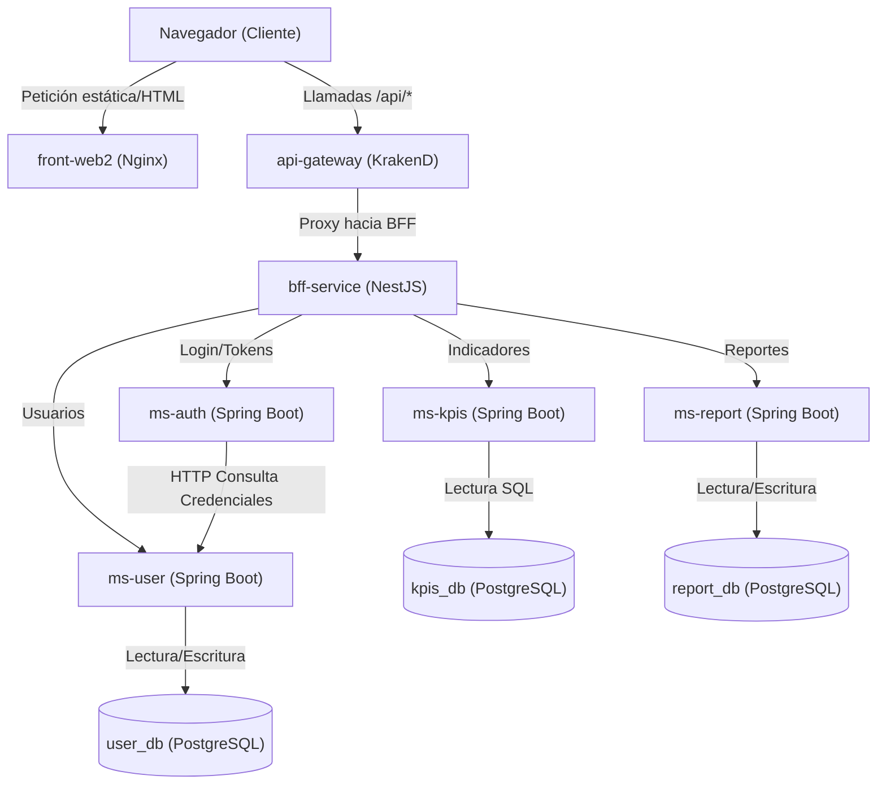

# Informe Técnico: Arquitectura, Stack y Patrones de Diseño
## Proyecto: Grupo Cordillera

Este documento recopila la información estructural y técnica del sistema **Grupo Cordillera**, incluyendo su funcionamiento, el detalle de componentes y versiones de su stack, la descripción de su arquitectura distribuida y ejemplos reales de código fuente donde se implementan patrones de diseño y de arquitectura. 

Al final del documento, se incluye una **propuesta de prompt optimizada para NotebookLM** diseñada para generar una presentación/defensa técnica del proyecto.

---

## 1. Información y Funcionamiento del Proyecto

**Grupo Cordillera** es un sistema de dashboard empresarial estructurado bajo un enfoque de microservicios y capas desacopladas. Su propósito es proveer una interfaz visual unificada donde los usuarios de negocio puedan:
1. **Iniciar sesión** de forma segura y gestionar su sesión.
2. **Visualizar Indicadores Clave de Rendimiento (KPIs)** en tiempo real (ventas totales, margen de ganancia, alertas críticas, satisfacción, etc.).
3. **Revisar alertas operacionales** organizadas y priorizadas.
4. **Administrar usuarios** (creación y visualización de perfiles).
5. **Gestionar reportes** (creación de nuevos reportes y listado histórico).

El sistema destaca por su separación de responsabilidades y su preparación para entornos cloud y locales mediante **Docker Compose** y **Kubernetes (k8s)** con observabilidad integrada hacia **GlitchTip** (Sentry-compatible) para capturar excepciones de frontend y BFF.

---

## 2. Stack Tecnológico y Versiones

La consistencia técnica del stack se mantiene a través de las siguientes tecnologías y versiones declaradas en los archivos de configuración (`package.json`, `pom.xml`, `Dockerfile`):

| Capa / Componente | Tecnología | Versión | Archivo Fuente de Verificación |
|---|---|---|---|
| **Frontend Web** | React | `^19.2.5` | `frontend/package.json` |
| | TypeScript | `~6.0.2` | `frontend/package.json` |
| | Vite | `^8.0.10` | `frontend/package.json` |
| | Tailwind CSS | `^4.2.4` | `frontend/package.json` |
| | `@sentry/react` | `^8.12.0` | `frontend/package.json` |
| | Nginx (en contenedor) | `1.27` | `frontend/Dockerfile` |
| **API Gateway** | KrakenD | `2.13` | `backend/api-gateway/Dockerfile` |
| **BFF (Backend for Frontend)** | NestJS | `^11.1.9` | `backend/bff/package.json` |
| | Node.js (Runtime) | `22` | `backend/bff/Dockerfile` |
| | `@sentry/node` | `^8.55.2` | `backend/bff/package.json` |
| | Jest / ts-jest | `^30.4.2` / `^29.4.6` | `backend/bff/package.json` |
| **Microservicios (Auth, User, KPIs, Report)** | Java | `25` | `backend/ms-*/pom.xml` |
| | Spring Boot | `4.0.6` | `backend/ms-*/pom.xml` |
| | Nimbus JOSE JWT | `10.5` | `backend/ms-auth/pom.xml` |
| | Springdoc OpenAPI (Swagger UI) | `2.8.9` | `backend/ms-*/pom.xml` |
| | JaCoCo (Cobertura >= 60%) | `0.8.13` | `backend/ms-*/pom.xml` |
| **Bases de Datos** | PostgreSQL | `16` | `docker-compose.yml` |
| | Flyway (Migraciones SQL) | Auto-config | `backend/ms-*/pom.xml` |
| **Observabilidad** | GlitchTip | compatible Sentry | `docker-compose-glitchtip.yml` |

---

## 3. Arquitectura del Sistema

El sistema utiliza una arquitectura distribuida por contenedores que sigue el siguiente flujo de comunicación:



* **Docker Compose:** El frontend escucha en `localhost:5173`. Su proxy Nginx desvía las rutas `/api/*` al puerto `8088` del `api-gateway`.
* **Kubernetes (k8s):** El recurso `Ingress` expone el host `grupo-cordillera.local`. Rutas `/api` van directamente a `api-gateway` y las demás `/` se envían a `front-web2`.

---

## 4. Patrones de Arquitectura Implementados

### A. API Gateway (KrakenD)
En lugar de abrir un proxy comodín (`*`), el API Gateway implementa un control explícito de endpoints en `krakend.json`. Esto centraliza el CORS, la propagación de headers de seguridad (`Authorization`) y desacopla la topología interna del clúster del cliente.
* **Ejemplo de configuración (`backend/api-gateway/krakend.json`):**
  ```json
  {
    "endpoint": "/api/kpis/summary",
    "method": "GET",
    "backend": [
      {
        "host": ["http://bff-service:8000"],
        "url_pattern": "/api/kpis/summary",
        "method": "GET"
      }
    ]
  }
  ```

### B. Backend For Frontend (BFF) (NestJS)
El BFF actúa como fachada única para el frontend. Valida preliminarmente los tokens Bearer y enruta las solicitudes hacia los microservicios correctos.
* **Implementación genérica del Proxy (`backend/bff/src/common/utils/http-client.ts`):**
  ```typescript
  export async function proxyRequest(
    request: Request,
    response: Response,
    baseUrl: string,
    publicPrefix: string,
  ): Promise<ProxyResult> {
    const targetPath = request.originalUrl.replace(publicPrefix, '') || '';
    const targetUrl = `${baseUrl}${targetPath}`;
    const upstream = await fetch(targetUrl, {
      method: request.method,
      headers: buildHeaders(request),
      body: ['GET', 'HEAD'].includes(request.method) ? undefined : JSON.stringify(request.body ?? {}),
    });
    const payload = await parsePayload(upstream);
    response.status(upstream.status).send(payload);
    return { status: upstream.status, payload };
  }
  ```

### C. Database per Service
Cada microservicio es dueño de su almacenamiento, garantizando un acoplamiento laxo.
* `ms-user` accede únicamente a `user_db`.
* `ms-kpis` accede únicamente a `kpis_db`.
* `ms-report` accede únicamente a `report_db`.
* `ms-auth` no posee base de datos y se comunica vía HTTP con `ms-user`.

---

## 5. Patrones de Diseño de Código

### A. Patrón Strategy & Factory (en `ms-kpis`)
Para evitar una lógica de controlador repleta de bloques condicionales (`if/else` o `switch`) al consultar distintos tipos de indicadores, `ms-kpis` define una interfaz `KpiStrategy` y utiliza una fábrica (`KpiStrategyFactory`) registrada en el contenedor de Spring Boot para inyectar y resolver dinámicamente la estrategia correspondiente.

1. **Interfaz de la Estrategia (`KpiStrategy.java`):**
   ```java
   package com.grupocordillera.kpis.service.strategy;
   import com.grupocordillera.kpis.model.KpiType;

   public interface KpiStrategy<T> {
       KpiType supports();
       T execute();
   }
   ```

2. **Implementación de una Estrategia Concreta (`SummaryKpiStrategy.java`):**
   ```java
   package com.grupocordillera.kpis.service.strategy;
   import com.grupocordillera.kpis.dto.KpiSummaryResponse;
   import com.grupocordillera.kpis.model.KpiType;
   import com.grupocordillera.kpis.repository.InMemoryKpiRepository;
   import org.springframework.stereotype.Component;

   @Component
   public class SummaryKpiStrategy implements KpiStrategy<KpiSummaryResponse> {
       private final InMemoryKpiRepository repository;

       public SummaryKpiStrategy(InMemoryKpiRepository repository) {
           this.repository = repository;
       }

       @Override
       public KpiType supports() {
           return KpiType.SUMMARY;
       }

       @Override
       public KpiSummaryResponse execute() {
           return new KpiSummaryResponse(
                   repository.getTotalSales(),
                   repository.getProfitMargin(),
                   repository.getCriticalStock(),
                   repository.getActiveClaims(),
                   repository.getAverageTicket(),
                   repository.getCustomerSatisfaction()
           );
       }
   }
   ```

3. **Fábrica de Estrategias (`KpiStrategyFactory.java`):**
   ```java
   package com.grupocordillera.kpis.service.factory;
   import com.grupocordillera.kpis.model.KpiType;
   import com.grupocordillera.kpis.service.strategy.KpiStrategy;
   import org.springframework.stereotype.Component;
   import java.util.EnumMap;
   import java.util.List;
   import java.util.Map;

   @Component
   public class KpiStrategyFactory {
       private final Map<KpiType, KpiStrategy<?>> strategies = new EnumMap<>(KpiType.class);

       // Spring inyecta automáticamente todas las implementaciones de KpiStrategy
       public KpiStrategyFactory(List<KpiStrategy<?>> strategyList) {
           for (KpiStrategy<?> strategy : strategyList) {
               strategies.put(strategy.supports(), strategy);
           }
       }

       public KpiStrategy<?> getStrategy(KpiType type) {
           KpiStrategy<?> strategy = strategies.get(type);
           if (strategy == null) {
               throw new IllegalArgumentException("No existe una estrategia para: " + type);
           }
           return strategy;
       }
   }
   ```

---

### B. Patrón Client/Adapter (en `ms-auth`)
El servicio `ms-auth` necesita delegar la validación y persistencia de usuarios en `ms-user`. Para evitar acoplar los controladores directamente a llamadas REST genéricas, se implementa una interfaz `UserClient` (Puerto) y una clase `HttpUserClient` (Adaptador de salida) utilizando el nuevo `RestClient` de Spring Boot.

1. **Puerto o Interfaz del Cliente (`UserClient.java`):**
   ```java
   package com.grupocordillera.authservice.client;
   import com.grupocordillera.authservice.dto.UserDto;
   import com.grupocordillera.authservice.model.User;
   import java.util.List;
   import java.util.Optional;

   public interface UserClient {
       User create(UserDto userDto);
       Optional<User> authenticate(String login, String password);
       List<User> findAll();
   }
   ```

2. **Adaptador de Infraestructura HTTP (`HttpUserClient.java`):**
   ```java
   package com.grupocordillera.authservice.client;
   import com.grupocordillera.authservice.dto.UserDto;
   import com.grupocordillera.authservice.model.User;
   import org.springframework.beans.factory.annotation.Value;
   import org.springframework.stereotype.Component;
   import org.springframework.web.client.HttpClientErrorException;
   import org.springframework.web.client.RestClient;
   import java.util.Optional;

   @Component
   public class HttpUserClient implements UserClient {
       private final RestClient restClient;

       public HttpUserClient(@Value("${user-service.url}") String userServiceUrl) {
           this.restClient = RestClient.builder().baseUrl(userServiceUrl).build();
       }

       @Override
       public Optional<User> authenticate(String login, String password) {
           try {
               User user = restClient.post()
                       .uri("/authenticate")
                       .body(new AuthenticateUserRequest(login, password))
                       .retrieve()
                       .body(User.class);
               return Optional.ofNullable(user);
           } catch (HttpClientErrorException ex) {
               if (ex.getStatusCode().value() == 401) {
                   return Optional.empty();
               }
               throw new IllegalArgumentException("Error al autenticar contra ms-user");
           }
       }

       @Override
       public User create(UserDto userDto) {
           // Lógica de mapeo y POST HTTP hacia el endpoint de ms-user
           // ...
       }
       
       @Override
       public List<User> findAll() {
           // ...
       }

       private record AuthenticateUserRequest(String login, String password) {}
   }
   ```

---

## 6. Propuesta de Prompt para NotebookLM

Para lograr que NotebookLM genere una presentación y audio-discusión precisa, interactiva y estructurada para tu defensa del proyecto, te sugiero subir este documento como fuente y proveerle el siguiente prompt estructurado:

```text
Actúa como un profesor experto y miembro del jurado de evaluación de proyectos de título de Ingeniería de Software. A partir de los documentos técnicos del proyecto "Grupo Cordillera" que te he proporcionado, genera un guion detallado y una estructura de diapositivas para una presentación de defensa técnica de 15 minutos. 

Asegúrate de estructurar la explicación en las siguientes secciones clave:

1. INTRODUCCIÓN Y CONTEXTO:
   - Explicar qué es Grupo Cordillera (Dashboard empresarial modular).
   - Por qué se escogió una arquitectura de microservicios con backend desacoplado en lugar de un monolito.

2. ARQUITECTURA GENERAL (FLUJO DE NAVEGACIÓN):
   - Detallar paso a paso el flujo que sigue una petición desde el navegador del usuario, pasando por el API Gateway (KrakenD), la fachada del BFF (NestJS), y finalmente el microservicio de Spring Boot correspondiente.
   - Explicar las ventajas del patrón API Gateway y el rol del BFF (limpieza de datos, encapsulado del JWT y centralización de la observabilidad con GlitchTip).

3. DETALLE DEL STACK TECNOLÓGICO Y VERSIONES:
   - Resaltar que el proyecto utiliza componentes modernos y robustos: React 19, TypeScript 6.0, NestJS 11 y microservicios con Java 25 y Spring Boot 4.0.6.
   - Mencionar cómo se realiza la persistencia independiente por microservicio usando PostgreSQL 16 y Flyway para control de esquemas.

4. EXPLICACIÓN DE PATRONES DE DISEÑO EN CÓDIGO (CON EJEMPLOS):
   - Detallar la implementación del patrón Strategy + Factory en "ms-kpis" utilizando KpiStrategyFactory y SummaryKpiStrategy para evitar lógica condicional acoplada en controladores.
   - Detallar la implementación del patrón Client/Adapter en "ms-auth" (UserClient y HttpUserClient) para comunicarse de forma desacoplada con "ms-user".

5. INFRAESTRUCTURA Y DESPLIEGUE (DOCKER & KUBERNETES):
   - Explicar la dualidad del entorno: desarrollo rápido con Docker Compose y despliegue robusto en Kubernetes local con Docker Desktop usando manifiestos organizados en Kustomize.
   - Explicar la estrategia de observabilidad y captura de errores (GlitchTip/Sentry compatible) conectada al frontend y al BFF.

6. CONCLUSIÓN Y PROPUESTA DE MEJORA:
   - Resumir por qué el proyecto cumple con los estándares empresariales de escalabilidad y tolerancia a fallos.
   - Mencionar las mejoras a futuro indicadas en el documento (ej. Circuit breakers, BCrypt en passwords iniciales, y validación completa del token JWT contra la llave pública).

Adopta un tono sumamente técnico, formal, explicativo y estructurado, listo para una defensa de título o exposición frente a arquitectos de software.
```
