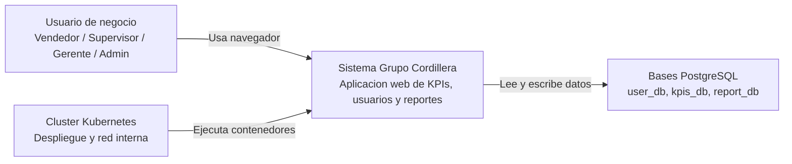
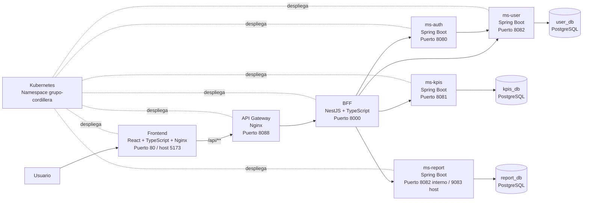
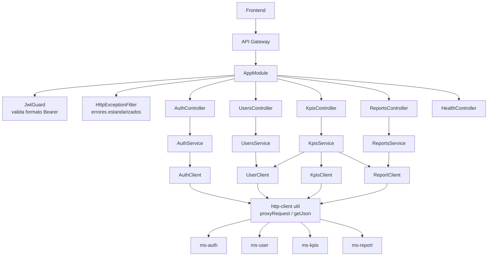
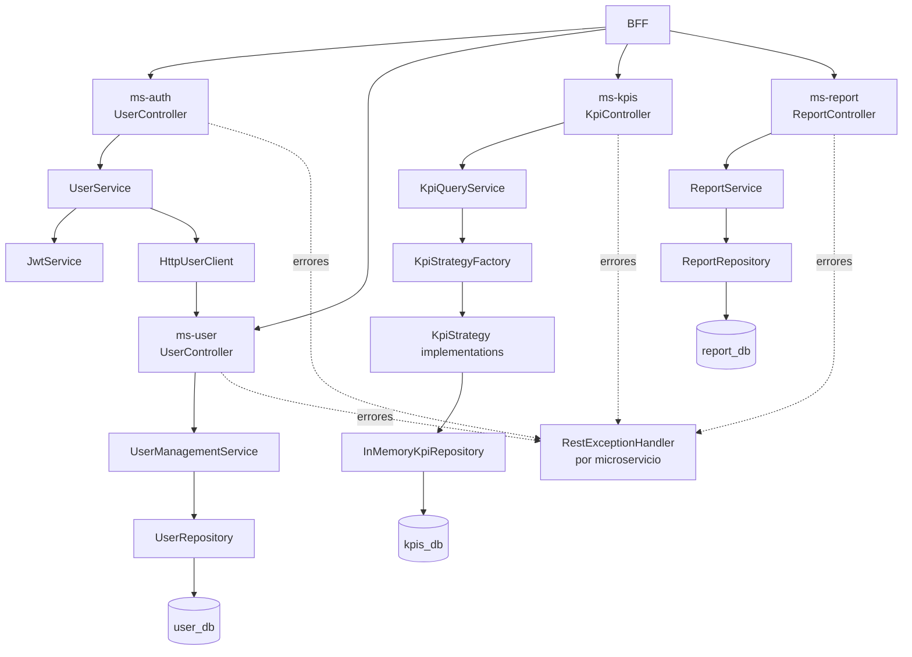
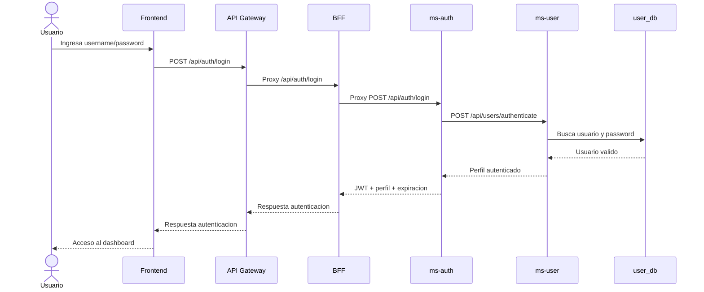
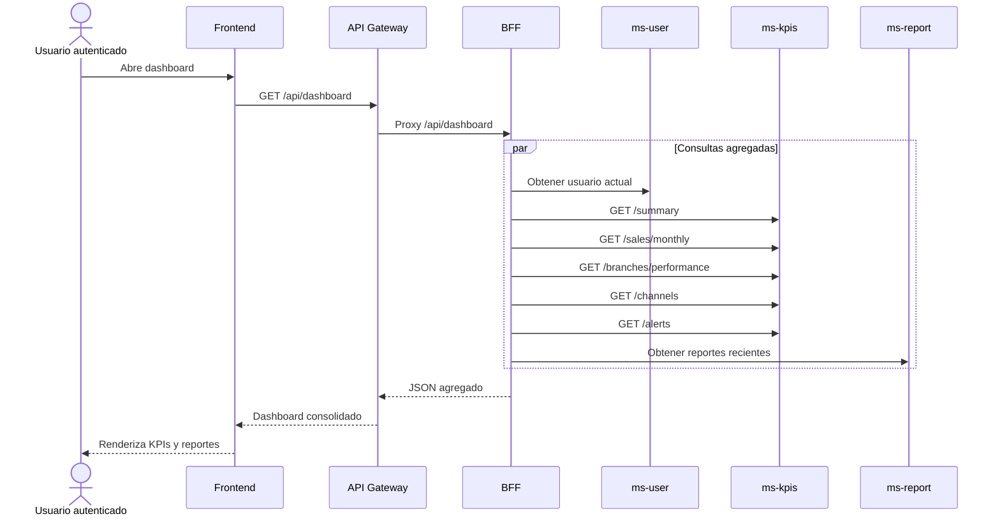
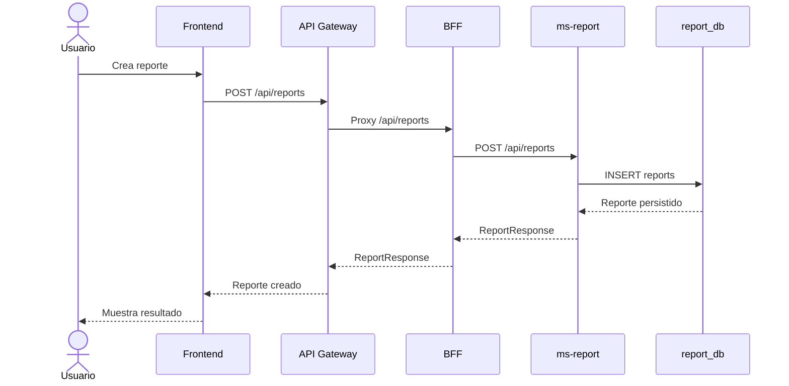
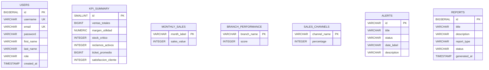

# Informe tecnico del proyecto Grupo Cordillera

Documento preparado para generar un informe tecnico, una presentacion de maximo 5 minutos y una defensa tecnica del proyecto.

> Criterio usado: este informe se basa en archivos reales del repositorio. Cuando un elemento no aparece en el codigo o manifiestos, se marca como "no encontrado" o "no evidenciado en el proyecto".

## 1. Resumen ejecutivo

Grupo Cordillera es una aplicacion web orientada a la gestion y visualizacion de informacion operativa. El sistema permite iniciar sesion, consultar indicadores de negocio, revisar alertas, administrar usuarios y trabajar con reportes.

El problema que resuelve es centralizar informacion clave para perfiles operativos y de gestion, evitando que el frontend tenga que conocer directamente todos los microservicios internos. La aplicacion esta pensada para usuarios como vendedores, supervisores, gerentes o administradores, segun los perfiles usados en el frontend y datos semilla.

Tecnologias principales evidenciadas:

| Capa | Tecnologia |
|---|---|
| Frontend | React, TypeScript, Vite, Nginx |
| API Gateway | Nginx |
| BFF | NestJS, TypeScript, Node.js |
| Microservicios | Java 25, Spring Boot 4 |
| Base de datos | PostgreSQL 16 |
| Migraciones | Flyway |
| Documentacion API | Springdoc OpenAPI / Swagger UI |
| Pruebas | JUnit, Jest, JaCoCo |
| Contenedores | Docker, Docker Compose |
| Orquestacion | Kubernetes |

Flujo general:

```text
Usuario
  -> Frontend React
    -> API Gateway Nginx
      -> BFF NestJS
        -> ms-auth / ms-user / ms-kpis / ms-report
          -> PostgreSQL por servicio
            -> Kubernetes despliega y conecta los contenedores
```

## 2. Arquitectura general del sistema

La arquitectura esta organizada por capas y responsabilidades. El frontend no consume directamente las bases de datos ni deberia conocer la topologia completa del backend. Las llamadas se concentran en rutas `/api/...`, que son enviadas al API Gateway y luego al BFF.

| Componente | Responsabilidad | Llama a |
|---|---|---|
| Usuario | Usa la aplicacion web desde navegador | Frontend |
| Frontend | Renderiza pantallas, captura credenciales y consume endpoints `/api` | API Gateway mediante Nginx o BFF en desarrollo |
| API Gateway | Punto unico de entrada HTTP para `/api/**`, CORS y proxy hacia BFF | BFF |
| BFF | Adapta respuestas para el frontend, centraliza llamadas y agrega dashboard | ms-auth, ms-user, ms-kpis, ms-report |
| ms-auth | Login, registro, perfil, llave publica y emision de JWT | ms-user |
| ms-user | Gestiona usuarios y autentica credenciales contra su base | user_db |
| ms-kpis | Entrega KPIs, ventas mensuales, sucursales, canales y alertas | kpis_db |
| ms-report | Crea, lista y busca reportes | report_db |
| PostgreSQL | Persistencia separada por servicio | No llama a otros componentes |
| Kubernetes | Despliega contenedores, services, ingress, config y secretos | Todos los workloads |

Datos que viajan entre capas:

| Flujo | Datos principales |
|---|---|
| Login | username/password, respuesta con perfil, rol, token JWT y expiracion |
| Usuarios | username, email, password, nombre, apellido, rol |
| KPIs | resumen numerico, ventas mensuales, rendimiento de sucursales, canales, alertas |
| Reportes | titulo, descripcion, tipo, estado, fecha de generacion |
| Seguridad | Header `Authorization: Bearer <token>` en llamadas protegidas |

## 3. Diagramas C4

### C1 - Contexto



Servicios externos: no se evidencian integraciones externas de negocio. El sistema usa librerias/frameworks externos, pero no se encontro consumo de APIs externas.

### C2 - Contenedores



### C3 - Componentes del BFF



Nota tecnica: el `JwtGuard` esta implementado, pero solo valida que el header `Authorization` no exista o empiece con `Bearer `. No se encontro verificacion criptografica de firma ni expiracion del JWT dentro del BFF.

### C3 - Componentes de microservicios Java



## 4. Flujos principales para la demostracion

### Flujo 1: Inicio de sesion

Usuario: cualquier usuario registrado.

Objetivo: validar credenciales y obtener token JWT.

Paso a paso:

1. El usuario ingresa usuario y contrasena en el frontend.
2. El frontend llama `POST /api/auth/login`.
3. En contenedor, Nginx del frontend envia `/api/**` al API Gateway.
4. El API Gateway reenvia la peticion al BFF.
5. El BFF proxyfica hacia `ms-auth`.
6. `ms-auth` llama a `ms-user` para autenticar credenciales.
7. `ms-user` consulta `user_db`.
8. Si las credenciales son validas, `ms-auth` genera un JWT RS256.
9. El frontend recibe perfil, rol, expiracion y `accessToken`.
10. Las llamadas posteriores pueden incluir `Authorization: Bearer <token>`.

Endpoints involucrados:

| Capa | Endpoint |
|---|---|
| Frontend/API Gateway/BFF | `POST /api/auth/login` |
| ms-auth | `POST /api/auth/login` |
| ms-user | `POST /api/users/authenticate` |

Diagrama:



### Flujo 2: Consulta de dashboard agregado

Usuario: usuario autenticado.

Objetivo: cargar una vista consolidada para el frontend con usuario actual, KPIs y reportes.

Paso a paso:

1. El frontend solicita `GET /api/dashboard`.
2. API Gateway envia la llamada al BFF.
3. El BFF ejecuta `KpisService.getDashboard()`.
4. El BFF consulta en paralelo datos de usuario, resumen, ventas mensuales, sucursales, canales, alertas y reportes.
5. El BFF devuelve un objeto unico al frontend.

Endpoints involucrados:

| Servicio | Endpoint |
|---|---|
| BFF | `GET /api/dashboard` |
| ms-user | usado por `UserClient.getCurrentUser()` |
| ms-kpis | `/summary`, `/sales/monthly`, `/branches/performance`, `/channels`, `/alerts` |
| ms-report | listado de reportes recientes segun `ReportClient` |

Datos consultados:

| Origen | Datos |
|---|---|
| ms-user | usuario actual |
| ms-kpis | resumen KPI, ventas, sucursales, canales, alertas |
| ms-report | reportes |

Diagrama:



Nota: este flujo esta implementado en `Backend/bff/src/modules/kpis/kpis.service.ts`.

### Flujo 3: Creacion y consulta de reportes

Usuario: usuario autenticado con permisos funcionales de gestion o administracion.

Objetivo: crear y consultar reportes persistidos en `report_db`.

Paso a paso:

1. El usuario solicita crear un reporte.
2. El frontend llama `POST /api/reports`.
3. API Gateway envia la solicitud al BFF.
4. El BFF proxyfica hacia `ms-report`.
5. `ms-report` valida y guarda el reporte en `report_db`.
6. El usuario puede listar reportes con `GET /api/reports` o consultar uno con `GET /api/reports/{id}`.

Endpoints involucrados:

| Servicio | Endpoint |
|---|---|
| BFF/API Gateway | `POST /api/reports`, `GET /api/reports`, `GET /api/reports/{id}` |
| ms-report | `POST /api/reports`, `GET /api/reports`, `GET /api/reports/{id}` |

Datos modificados o consultados:

| Tabla | Campos |
|---|---|
| `reports` | `id`, `title`, `description`, `report_type`, `status`, `generated_at` |

Diagrama:



## 5. Patrones de diseno y arquitectura

| Patron | Estado | Donde aparece | Problema que resuelve | Como explicarlo |
|---|---|---|---|---|
| API Gateway | Implementado | `Backend/api-gateway/nginx.conf` | Centraliza entrada `/api/**` y oculta BFF | "El frontend no conoce el backend interno; entra por un unico punto." |
| BFF | Implementado | `Backend/bff` | Adapta backend a necesidades del frontend y agrega dashboard | "El BFF arma respuestas utiles para la pantalla y reduce llamadas del cliente." |
| Microservicios | Implementado | `ms-auth`, `ms-user`, `ms-kpis`, `ms-report` | Separa responsabilidades por dominio | "Cada servicio tiene una responsabilidad clara y se despliega separado." |
| Database per Service | Implementado parcialmente | `user_db`, `kpis_db`, `report_db`; `ms-auth` sin DB | Evita compartir persistencia entre servicios | "Usuarios, KPIs y reportes tienen sus propias bases; auth delega usuarios." |
| Layered Architecture | Implementado | Controllers, Services, Repositories/Clients | Separa presentacion, negocio y datos | "El controlador no accede directamente a la base." |
| Repository | Implementado | `UserRepository`, `ReportRepository`, `InMemoryKpiRepository` | Encapsula acceso a datos | "El servicio consulta repositorios, no SQL disperso en controladores." |
| Dependency Injection | Implementado | Spring `@Service`, `@Repository`; NestJS `@Injectable` | Reduce acoplamiento y facilita test | "Los componentes reciben dependencias por constructor." |
| DTO | Implementado | `dto/` en Java, `interfaces/` en BFF | Define contratos de entrada/salida | "Los datos viajan con estructuras claras." |
| Service Layer | Implementado | `UserManagementService`, `KpiQueryService`, `ReportService`, servicios BFF | Centraliza logica de aplicacion | "La logica no queda en el controlador." |
| Facade | Implementado en BFF | `KpisService.getDashboard()` | Unifica varias consultas internas | "El frontend pide un dashboard y el BFF junta multiples servicios." |
| Adapter | Implementado | `HttpUserClient`, clientes BFF | Encapsula llamadas HTTP a otros servicios | "Si cambia una URL o contrato, se toca el cliente, no todo el sistema." |
| Middleware / Filter | Implementado | `HttpExceptionFilter`, `RestExceptionHandler` | Estandariza errores | "Los errores salen con formato controlado." |
| Guards | Implementado parcialmente | `JwtGuard` en BFF | Controla paso de requests por auth | "Existe guard, pero hoy solo valida formato Bearer." |
| Factory | Implementado | `KpiStrategyFactory` | Selecciona estrategia KPI por tipo | "Evita condicionales grandes para elegir KPI." |
| Strategy | Implementado | `KpiStrategy` y clases `*Strategy` | Cambia algoritmo segun tipo de KPI | "Cada KPI se calcula o consulta con una estrategia propia." |
| Singleton | No evidenciado como patron manual | Contenedores DI pueden usar singletons por defecto, pero no hay implementacion explicita | No aplica | "No se presenta como decision de diseno propia." |
| Circuit Breaker | No encontrado | No se encontro Resilience4j u otro breaker | No aplica | "Riesgo: si un servicio falla, no hay breaker formal." |
| Event Driven | No encontrado | No hay Kafka, RabbitMQ ni eventos | No aplica | "La comunicacion actual es HTTP sincrona." |
| CQRS | No encontrado | No hay separacion formal command/query | No aplica | "Los servicios usan CRUD/queries tradicionales." |

## 6. Modelo de datos

### Entidades y tablas

| Microservicio | Base | Tabla | Clave primaria | Atributos importantes |
|---|---|---|---|---|
| ms-user | `user_db` | `users` | `id BIGSERIAL` | `username`, `email`, `password`, `first_name`, `last_name`, `role`, `created_at` |
| ms-kpis | `kpis_db` | `kpi_summary` | `id SMALLINT` | `ventas_totales`, `margen_utilidad`, `stock_critico`, `reclamos_activos`, `ticket_promedio`, `satisfaccion_cliente` |
| ms-kpis | `kpis_db` | `monthly_sales` | `month_label` | `sales_value` |
| ms-kpis | `kpis_db` | `branch_performance` | `branch_name` | `score` |
| ms-kpis | `kpis_db` | `sales_channels` | `channel_name` | `percentage` |
| ms-kpis | `kpis_db` | `alerts` | `id` | `title`, `status`, `date_label`, `description` |
| ms-report | `report_db` | `reports` | `id BIGSERIAL` | `title`, `description`, `report_type`, `status`, `generated_at` |
| ms-auth | No tiene base evidenciada | No aplica | No aplica | Consume `ms-user` para autenticar |

Relaciones:

| Relacion | Estado |
|---|---|
| FK entre `users` y `reports` | No encontrada |
| FK entre KPIs y usuarios | No encontrada |
| FK entre microservicios | No encontrada, consistente con Database per Service |

### Diagrama entidad-relacion



Cada microservicio administra sus propios datos. `ms-user`, `ms-kpis` y `ms-report` tienen bases separadas. `ms-auth` no tiene base propia evidenciada; su responsabilidad es autenticacion y delega la persistencia de usuarios a `ms-user`.

## 7. Decisiones criticas de arquitectura

### Por que usar microservicios

Permite separar dominios: autenticacion, usuarios, KPIs y reportes. Cada servicio puede evolucionar con menor impacto sobre los demas, siempre que respete su contrato HTTP.

### Por que separar ms-auth, ms-user, ms-kpis y ms-report

| Servicio | Justificacion |
|---|---|
| ms-auth | Maneja credenciales, login, registro y JWT |
| ms-user | Es propietario de usuarios y credenciales persistidas |
| ms-kpis | Concentra consultas analiticas del dashboard |
| ms-report | Administra reportes y su persistencia |

### Por que usar BFF

El BFF reduce complejidad del frontend. Por ejemplo, `GET /api/dashboard` consolida informacion de usuarios, KPIs y reportes. Sin BFF, el frontend tendria que coordinar varias llamadas y conocer todos los servicios internos.

### Por que usar API Gateway

El API Gateway entrega un punto unico para `/api/**`, aplica headers CORS y oculta al BFF. Ademas facilita que el frontend use rutas relativas y que Kubernetes exponga una sola entrada para APIs.

### Seguridad

Implementado:

- `ms-auth` genera JWT usando llaves RSA (`private.pem` y `public.pem`).
- Existe endpoint `GET /api/auth/public-key`.
- El frontend recibe `accessToken`.
- El BFF tiene `JwtGuard`.

Limitacion evidenciada:

- El `JwtGuard` del BFF no valida criptograficamente la firma ni expiracion del JWT; solo revisa el formato del header `Bearer`.
- No se evidencio Spring Security completo en microservicios.

### Escalabilidad

Kubernetes permite escalar Deployments manualmente con replicas. Los manifiestos actuales usan `replicas: 1`. HPA no fue encontrado.

Mejora sugerida:

```bash
kubectl scale deployment bff-service -n grupo-cordillera --replicas=2
```

### Desacoplamiento

Se evita acoplamiento directo mediante:

- API Gateway como entrada unica.
- BFF como capa de composicion.
- Clients HTTP para consumir servicios.
- DTOs para contratos.
- Bases separadas por servicio.

### Ventajas

- Separacion clara de responsabilidades.
- Cada dominio tiene codigo y despliegue propio.
- El frontend queda simplificado.
- Migraciones Flyway controlan esquemas.
- Swagger permite probar APIs Java.
- Kubernetes organiza despliegue y red interna.

### Desventajas y riesgos

| Riesgo | Evidencia | Mejora |
|---|---|---|
| Validacion JWT incompleta en BFF | `JwtGuard` no verifica firma | Validar JWT con llave publica de `ms-auth` |
| Sin Circuit Breaker | No encontrado | Agregar Resilience4j o retry/backoff controlado |
| HPA no encontrado | No hay manifiesto autoscaling | Agregar HPA para BFF y servicios criticos |
| Comunicacion sincrona HTTP | No hay eventos | Evaluar eventos solo si aparece necesidad real |
| `docker-compose.yml` usa `./backend/...` mientras la carpeta visible es `Backend` | Diferencia de casing | Normalizar nombre de carpeta o rutas |

## 8. Validacion en Kubernetes

### Archivos encontrados

| Elemento | Estado | Archivos |
|---|---|---|
| Dockerfiles | Encontrado | `frontend/Dockerfile`, `Backend/api-gateway/Dockerfile`, `Backend/bff/Dockerfile`, Dockerfiles de microservicios |
| Docker Compose | Encontrado | `docker-compose.yml` |
| Namespace | Encontrado | `k8s/namespace.yaml` |
| ConfigMaps | Encontrado | `k8s/config.yaml`, `Backend/*/k8s/configmap.yaml` |
| Secrets | Encontrado | `k8s/config.yaml`, `Backend/*/k8s/secret.yaml` donde aplica |
| Deployments | Encontrado | `k8s/apps.yaml`, `Backend/*/k8s/deployment.yaml` |
| Services | Encontrado | `k8s/apps.yaml`, `k8s/databases.yaml`, `Backend/*/k8s/service.yaml` |
| Ingress | Encontrado | `k8s/ingress.yaml` |
| PVC | Encontrado | `k8s/databases.yaml` |
| HPA | No encontrado | No hay manifiesto `HorizontalPodAutoscaler` |

### Como demostrar en vivo

Aplicar recursos:

```bash
kubectl apply -f k8s/namespace.yaml
kubectl apply -f k8s/config.yaml
kubectl apply -f k8s/databases.yaml
kubectl apply -f backend/ms-auth/k8s/
kubectl apply -f backend/ms-kpis/k8s/
kubectl apply -f backend/ms-user/k8s/
kubectl apply -f backend/ms-report/k8s/
kubectl apply -f k8s/apps.yaml
kubectl apply -f k8s/ingress.yaml
```

Comandos de validacion:

```bash
kubectl get pods -n grupo-cordillera
```

Debe mostrar pods para frontend, api-gateway, bff, microservicios y bases. Idealmente todos en `Running` y `READY 1/1`.

```bash
kubectl get services -n grupo-cordillera
```

Debe mostrar servicios internos como `front-web2`, `api-gateway`, `bff-service`, `auth-service`, `user-service`, `kpis-service`, `report-service`, `user-db`, `kpis-db`, `report-db`.

```bash
kubectl get deployments -n grupo-cordillera
```

Debe mostrar deployments con `READY 1/1`, porque los manifiestos usan una replica.

```bash
kubectl get ingress -n grupo-cordillera
```

Debe mostrar `grupo-cordillera-ingress` con host `grupo-cordillera.local`.

```bash
kubectl describe pod <nombre-pod> -n grupo-cordillera
```

Sirve para mostrar eventos, imagen usada, variables, probes y errores si un contenedor no levanta.

```bash
kubectl logs <nombre-pod> -n grupo-cordillera
```

Sirve para demostrar que el servicio arranco y responde a peticiones.

Validacion funcional:

```bash
curl http://grupo-cordillera.local/health
curl http://grupo-cordillera.local/api/auth/health
```

Nota: el Ingress enruta `/` al frontend y `/api` al API Gateway. El endpoint `/health` directo pertenece al API Gateway si se invoca por su servicio; desde Ingress, `/health` puede caer en frontend porque la regla explicita de API es `/api`.

## 9. Guion para presentacion de maximo 5 minutos

### Minuto 0:00 a 1:00 - Introduccion

Que decir:

"Este proyecto es una plataforma web para Grupo Cordillera. Permite iniciar sesion, visualizar indicadores, consultar alertas, administrar usuarios y trabajar con reportes. La arquitectura separa frontend, gateway, BFF, microservicios y bases de datos para mantener responsabilidades claras."

Que mostrar:

- Pantalla de login o dashboard.
- Diagrama C1.

Diagrama:

- C1 - Contexto.

### Minuto 1:00 a 2:00 - Arquitectura C1, C2 y C3

Que decir:

"El usuario entra por el frontend React. Las llamadas `/api` pasan por Nginx, primero al API Gateway y luego al BFF. El BFF decide si la llamada va a autenticacion, usuarios, KPIs o reportes. Cada microservicio Java tiene su responsabilidad y su base PostgreSQL cuando corresponde."

Que mostrar:

- C2 - Contenedores.
- C3 - Componentes del BFF.

Diagrama:

- C2 para explicar componentes.
- C3 BFF para explicar controllers, services y clients.

### Minuto 2:00 a 3:00 - Demo de login

Que decir:

"El login viaja desde el frontend hasta `ms-auth`. `ms-auth` no guarda usuarios directamente; llama a `ms-user`, que valida contra `user_db`. Si las credenciales son validas, `ms-auth` genera un JWT firmado."

Que mostrar:

- Login en la aplicacion.
- Swagger de `ms-auth`: `http://localhost:9080/swagger-ui/index.html`.

Comando opcional:

```bash
curl -X POST http://localhost:8088/api/auth/login \
  -H "Content-Type: application/json" \
  -d "{\"username\":\"gerente\",\"password\":\"1234\"}"
```

Credenciales semilla evidenciadas: `gerente`, `supervisor` y `vendedor`, todas con password `1234`.

### Minuto 3:00 a 4:00 - Dos flujos funcionales

Que decir:

"El primer flujo funcional es el dashboard agregado. El frontend pide un solo endpoint, `/api/dashboard`, y el BFF junta datos de usuarios, KPIs y reportes. El segundo flujo es reportes: se crean y consultan reportes que quedan persistidos en `report_db`."

Que mostrar:

- Dashboard.
- Swagger de KPIs: `http://localhost:9081/swagger-ui/index.html`.
- Swagger de reportes: `http://localhost:9083/swagger-ui/index.html`.

Comandos:

```bash
curl http://localhost:8088/api/kpis/summary
curl http://localhost:8088/api/reports
```

### Minuto 4:00 a 5:00 - Patrones, Kubernetes y cierre

Que decir:

"Los patrones principales son API Gateway, BFF, microservicios, Repository, Service Layer, DTO, Strategy y Factory. En Kubernetes existen namespace, deployments, services, configmaps, secrets, PVCs e ingress. No se encontro HPA ni circuit breaker, que son mejoras naturales para una version productiva."

Que mostrar:

- Manifiestos Kubernetes.
- Estado del cluster.

Comandos:

```bash
kubectl get pods -n grupo-cordillera
kubectl get services -n grupo-cordillera
kubectl get ingress -n grupo-cordillera
```

Cierre:

"La principal fortaleza del proyecto es que separa responsabilidades y expone un flujo claro desde el usuario hasta los datos. La principal mejora tecnica seria fortalecer validacion JWT, resiliencia y autoscaling."

## 10. Preguntas probables de defensa

| Pregunta | Respuesta breve |
|---|---|
| 1. Que problema resuelve el sistema? | Centraliza login, KPIs, usuarios y reportes en una aplicacion web para gestion operativa. |
| 2. Por que usaron API Gateway? | Para tener una entrada unica `/api/**`, aplicar proxy/CORS y ocultar servicios internos. |
| 3. Por que existe un BFF si ya hay API Gateway? | El Gateway enruta; el BFF adapta y agrega respuestas para el frontend. |
| 4. Que microservicios existen? | `ms-auth`, `ms-user`, `ms-kpis` y `ms-report`. |
| 5. Que hace `ms-auth`? | Gestiona login, registro, perfil, llave publica y JWT. |
| 6. Donde se guardan los usuarios? | En `user_db`, administrada por `ms-user`. |
| 7. `ms-auth` tiene base propia? | No se evidencio base propia; delega usuarios a `ms-user`. |
| 8. Como se comunican los servicios? | Por HTTP REST sincrono. |
| 9. Hay eventos o mensajeria? | No encontrado. No hay Kafka, RabbitMQ ni arquitectura event-driven. |
| 10. Que patron usa `ms-kpis`? | Strategy y Factory para seleccionar tipos de KPIs. |
| 11. Que es Database per Service? | Cada servicio administra su propia base y otros servicios no acceden directamente a ella. |
| 12. Se cumple Database per Service? | Si para `ms-user`, `ms-kpis` y `ms-report`; `ms-auth` no tiene DB y delega usuarios. |
| 13. Que rol cumple Flyway? | Versiona y aplica migraciones de esquema en bases PostgreSQL. |
| 14. Donde se ve Swagger? | En cada microservicio Java: puertos 9080, 9081, 9082 y 9083 en local. |
| 15. Como funciona el login? | Frontend -> Gateway -> BFF -> ms-auth -> ms-user -> user_db; luego ms-auth emite JWT. |
| 16. El JWT se valida completamente en BFF? | No. El guard actual solo valida formato `Bearer`; falta verificar firma y expiracion. |
| 17. Como se manejan errores? | Con `RestExceptionHandler` en microservicios y `HttpExceptionFilter` en BFF. |
| 18. Que contiene Kubernetes? | Namespace, ConfigMaps, Secrets, Deployments, Services, PVCs e Ingress. |
| 19. Existe HPA? | No encontrado. |
| 20. Como escalarian el sistema? | Aumentando replicas en Deployments y agregando HPA para servicios criticos. |
| 21. Que pasa si falla un microservicio? | No hay circuit breaker evidenciado; el BFF recibiria error HTTP o fallo de fetch. |
| 22. Por que no conectar frontend directo a microservicios? | Aumentaria acoplamiento, expondria topologia interna y duplicaria logica en cliente. |
| 23. Que ventaja tiene el BFF en dashboard? | Agrega varias respuestas internas en un unico endpoint para el frontend. |
| 24. Que base usa reportes? | `report_db`, con tabla `reports`. |
| 25. Que mejora harian primero? | Validacion JWT real en BFF/microservicios, circuit breaker y HPA. |

## 11. Resumen para generar presentacion en NotebookLM

Titulo sugerido:

"Grupo Cordillera: arquitectura web con API Gateway, BFF, microservicios y Kubernetes"

Objetivo de la presentacion:

Explicar en 5 minutos como el sistema conecta frontend, API Gateway, BFF, microservicios, bases PostgreSQL y Kubernetes para entregar login, dashboard de KPIs y reportes.

Lista recomendada de diapositivas:

| Diapositiva | Contenido |
|---|---|
| 1. Problema y solucion | Sistema web para centralizar login, KPIs, usuarios y reportes |
| 2. Arquitectura general | Diagrama C2 con Frontend -> Gateway -> BFF -> microservicios -> bases |
| 3. Componentes internos | C3 del BFF y microservicios Java |
| 4. Flujo de login | Secuencia login y JWT |
| 5. Flujos funcionales | Dashboard agregado y reportes |
| 6. Patrones usados | API Gateway, BFF, microservicios, Repository, DTO, Strategy, Factory |
| 7. Datos y persistencia | Database per Service con `user_db`, `kpis_db`, `report_db` |
| 8. Kubernetes | Namespace, Deployments, Services, Ingress, ConfigMaps, Secrets, PVCs |
| 9. Riesgos y mejoras | JWT incompleto en BFF, sin HPA, sin circuit breaker |
| 10. Cierre | Fortalezas del diseno y defensa tecnica |

Diagramas que se deben incluir:

- C1 Contexto.
- C2 Contenedores.
- C3 BFF.
- Secuencia de login.
- Secuencia de dashboard.
- ERD de bases de datos.

Flujos que se deben demostrar:

1. Login: `POST /api/auth/login`.
2. Dashboard agregado: `GET /api/dashboard`.
3. Reportes: `POST /api/reports` y `GET /api/reports`.

Ideas clave para defender el proyecto:

- El API Gateway enruta y oculta el backend interno.
- El BFF adapta y agrega respuestas para el frontend.
- Los microservicios separan dominios y responsabilidades.
- Las bases estan separadas por servicio, evitando acoplamiento directo.
- Flyway versiona esquemas y Swagger facilita pruebas.
- Kubernetes demuestra despliegue real con services, ingress, config y persistencia.
- Las mejoras tecnicas claras son validar JWT completamente, agregar circuit breaker y autoscaling.
