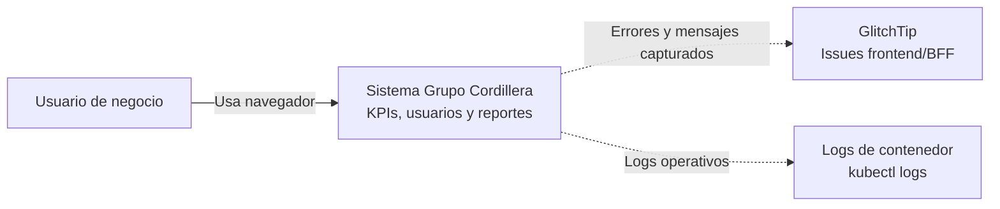
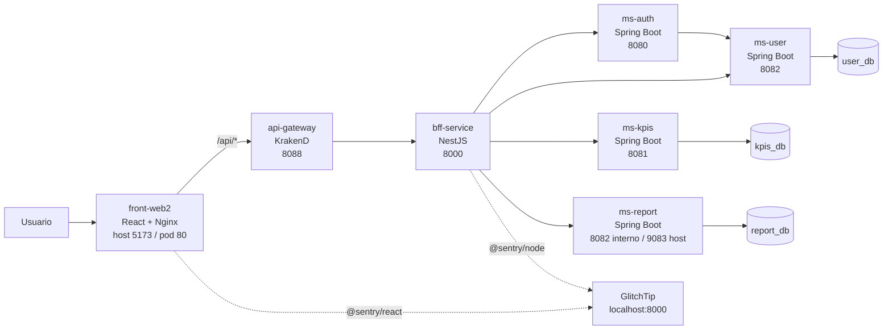
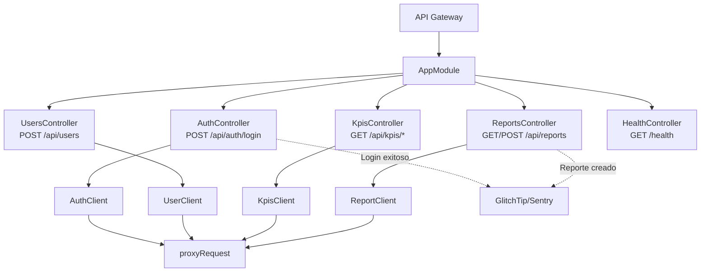

# Informe tecnico del proyecto Grupo Cordillera

Documento base para informe, presentacion y defensa tecnica. Esta version resume el estado actual del repositorio.

## 1. Resumen ejecutivo

Grupo Cordillera es una aplicacion web para iniciar sesion, visualizar KPIs, revisar alertas, administrar usuarios y crear/listar reportes. La arquitectura separa presentacion, entrada HTTP, BFF, microservicios y persistencia.

Tecnologias principales:

| Capa | Tecnologia |
|---|---|
| Frontend | React, TypeScript, Vite, Nginx, `@sentry/react` |
| API Gateway | KrakenD |
| BFF | NestJS, TypeScript, Node.js, `@sentry/node` |
| Microservicios | Java 25, Spring Boot 4 |
| Base de datos | PostgreSQL 16 |
| Migraciones | Flyway |
| Documentacion API | Springdoc OpenAPI / Swagger UI |
| Pruebas | JUnit, Jest, JaCoCo |
| Contenedores | Docker, Docker Compose |
| Orquestacion | Kubernetes local en Docker Desktop |
| Observabilidad | GlitchTip para frontend/BFF; logs para microservicios Java |

Flujo general:

```text
Usuario
  -> Frontend React servido por Nginx
    -> API Gateway KrakenD
      -> BFF NestJS
        -> ms-auth / ms-user / ms-kpis / ms-report
          -> PostgreSQL por servicio
```

## 2. Arquitectura

| Componente | Responsabilidad | Llama a |
|---|---|---|
| Frontend | Renderiza pantallas y consume rutas `/api/*` | API Gateway |
| API Gateway | Punto unico de entrada HTTP para rutas publicas | BFF |
| BFF | Proxy especifico para el frontend y eventos GlitchTip del backend Node | Microservicios |
| ms-auth | Login y JWT RS256 | ms-user |
| ms-user | Usuarios y autenticacion de credenciales | user_db |
| ms-kpis | KPIs, graficos y alertas | kpis_db |
| ms-report | Reportes | report_db |
| GlitchTip | Issues/eventos Sentry del frontend y BFF | PostgreSQL/Redis propios de GlitchTip |
| Kubernetes | Deployments, Services, PVCs, ConfigMaps, Secrets e Ingress | Todos los workloads |

## 3. Diagramas C4

### C1 - Contexto



### C2 - Contenedores



### C3 - BFF



## 4. Flujos de demo

### Login

```text
Frontend -> POST /api/auth/login -> KrakenD -> BFF -> ms-auth -> ms-user -> user_db
```

Resultado:

- `ms-auth` devuelve perfil, rol, `tokenType`, `expiresIn` y `accessToken`.
- El BFF registra `business_metric=login_success`.
- El BFF envia a GlitchTip el mensaje `Login exitoso`.

### KPIs

El frontend consume:

```text
GET /api/kpis/summary
GET /api/kpis/sales/monthly
GET /api/kpis/branches/performance
GET /api/kpis/channels
GET /api/kpis/alerts
```

Todas las rutas pasan por KrakenD y BFF antes de llegar a `ms-kpis`.

### Reportes

```text
Frontend -> GET/POST /api/reports -> KrakenD -> BFF -> ms-report -> report_db
```

Cuando se crea un reporte, el BFF registra `business_metric=report_created` y envia a GlitchTip el mensaje `Reporte creado`.

## 5. Kubernetes

Despliegue recomendado:

```powershell
docker compose build
kubectl apply -k .
kubectl get pods -n grupo-cordillera
kubectl get ingress -n grupo-cordillera
```

Host local:

```text
http://grupo-cordillera.local
```

El archivo `k8s/ingress.yaml` enruta:

| Path | Servicio |
|---|---|
| `/` | `front-web2:80` |
| `/api` | `api-gateway:8088` |

## 6. GlitchTip

GlitchTip se levanta aparte:

```powershell
docker compose -f docker-compose-glitchtip.yml up -d
```

Luego se abre:

```text
http://localhost:8000
```

Nota: GlitchTip usa el puerto host `8000`, el mismo que el BFF publica cuando se ejecuta el proyecto completo por Docker Compose. Para demo con observabilidad, se recomienda GlitchTip en Docker Compose y la aplicacion en Kubernetes.

GlitchTip muestra issues/eventos, no logs continuos. Logs operativos:

```powershell
kubectl logs -n grupo-cordillera deployment/bff-service -f
kubectl logs -n grupo-cordillera deployment/auth-service -f
kubectl logs -n grupo-cordillera deployment/user-service -f
kubectl logs -n grupo-cordillera deployment/kpis-service -f
kubectl logs -n grupo-cordillera deployment/report-service -f
```

## 7. Patrones y decisiones

| Patron/decision | Estado actual |
|---|---|
| API Gateway | KrakenD con rutas explicitas |
| BFF | NestJS como fachada/proxy para el frontend |
| Microservicios | Separacion por auth, users, kpis y reports |
| Database per service | `user_db`, `kpis_db`, `report_db`; auth sin base propia |
| Flyway | Migraciones en servicios con persistencia |
| Repository | JPA en user/report, JDBC repository en KPIs |
| Strategy/Factory | Seleccion de KPIs en `ms-kpis` |
| DTO | Contratos en Java y TypeScript |
| Observabilidad | GlitchTip frontend/BFF y logs Kubernetes |

## 8. Riesgos y mejoras

| Riesgo | Mejora |
|---|---|
| Validacion JWT incompleta en BFF | Verificar firma y expiracion con llave publica de `ms-auth` |
| Sin circuit breaker | Agregar Resilience4j o retry/backoff controlado |
| Sin HPA | Agregar HorizontalPodAutoscaler para BFF y servicios criticos |
| Passwords seed en texto plano | Usar BCrypt |
| Microservicios Java sin SDK GlitchTip activo | Integrar SDK compatible con Spring Boot 4 o usar stack de logs/metricas |

## 9. Guion corto de defensa

1. El usuario entra al frontend React.
2. Las llamadas `/api/*` pasan por KrakenD.
3. El BFF decide a que microservicio enviar cada solicitud.
4. `ms-auth` delega usuarios a `ms-user` y emite JWT.
5. `ms-kpis` lee indicadores desde `kpis_db`.
6. `ms-report` persiste reportes en `report_db`.
7. Kubernetes levanta cada componente como deployment/service.
8. GlitchTip muestra issues/eventos del frontend y BFF; los logs normales se ven con `kubectl logs`.
