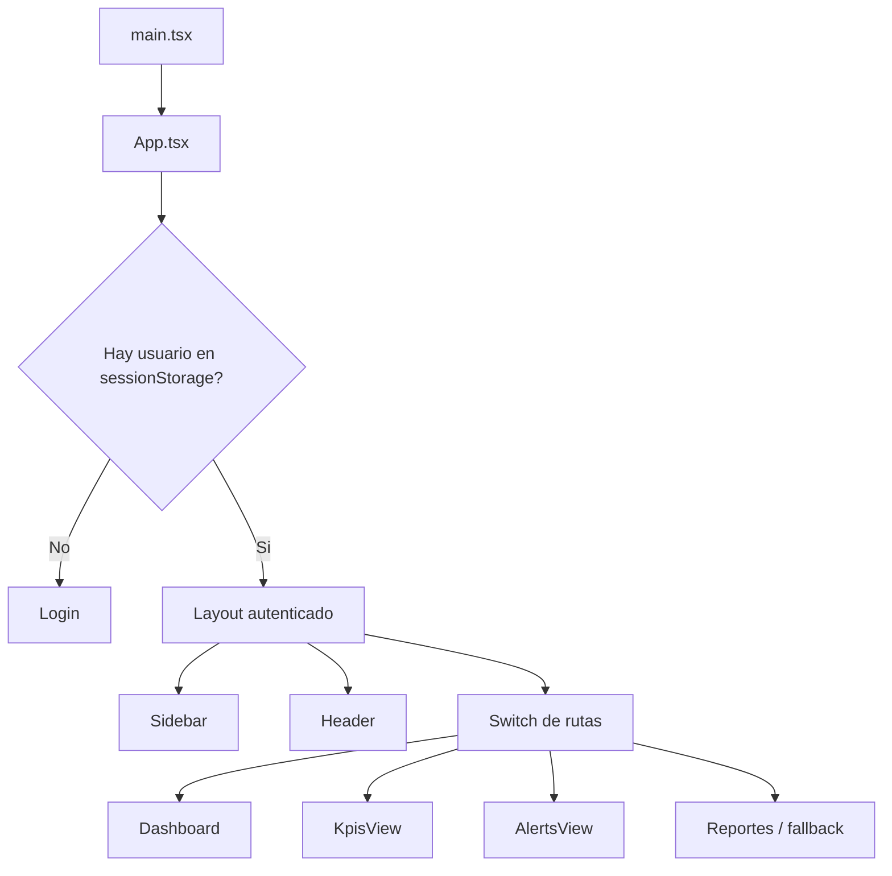
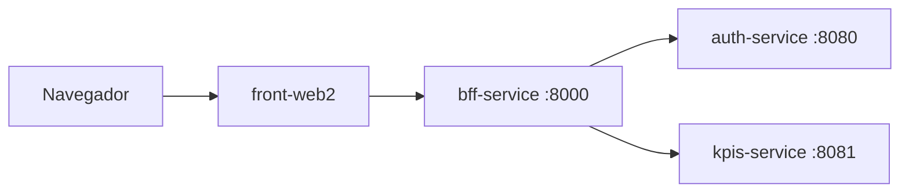
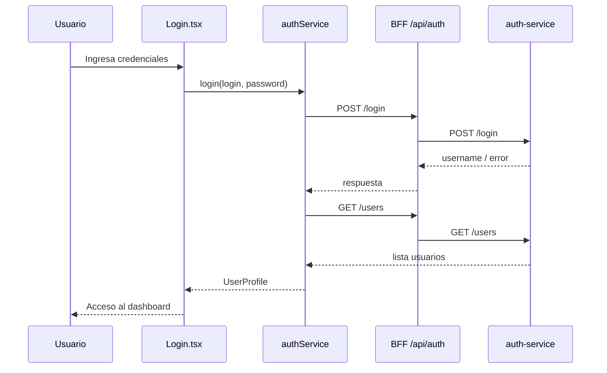
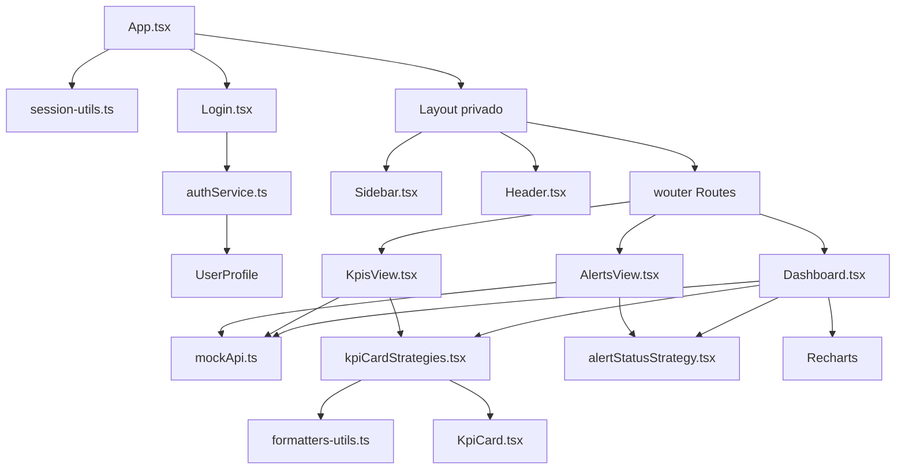

# Front Web 2 - Grupo Cordillera

## 1. Descripcion general

`front-web2` es la aplicacion web principal del panel de KPIs de Grupo Cordillera. Esta construida con React, TypeScript, Vite y Tailwind CSS. Su objetivo es entregar una interfaz administrativa para iniciar sesion, navegar entre modulos y visualizar indicadores de negocio como ventas, margen, stock critico, reclamos, desempeno por sucursal, ventas por canal y alertas.

La aplicacion pertenece a un monorepo con servicios backend separados:

- `auth-service`: servicio Java/Spring Boot para autenticacion y usuarios.
- `kpis-service`: servicio Java/Spring Boot para datos de KPIs.
- `bff-service`: Backend For Frontend en Node.js/Express que expone una API unificada al frontend.
- `front-web2`: frontend React servido por Vite en desarrollo y por Nginx en Docker.

Actualmente el login se conecta al backend mediante `VITE_USERS_API_URL`, mientras que los KPIs se consumen desde `mockApi`, un servicio simulado local en el frontend. Esto permite desarrollar la interfaz sin depender todavia del servicio real de KPIs.

## 2. Stack tecnologico

### Runtime y build

- **React 19**: libreria principal para construir la interfaz basada en componentes.
- **React DOM 19**: renderiza la aplicacion React en el DOM del navegador.
- **TypeScript 6**: agrega tipado estatico a componentes, servicios, tipos y utilidades.
- **Vite 8**: servidor de desarrollo y empaquetador de produccion. Provee arranque rapido, HMR y build optimizado.
- **@vitejs/plugin-react**: integra React con Vite.
- **Nginx**: servidor usado en el contenedor Docker final para servir los archivos estaticos generados por Vite.

### UI y estilos

- **Tailwind CSS 4**: framework utility-first para estilos. Se configura desde `src/index.css` usando `@import "tailwindcss"` y `@theme`.
- **@tailwindcss/vite**: plugin de Tailwind para Vite.
- **lucide-react**: set de iconos usado en sidebar, header, login, cards y badges de alerta.
- **Recharts**: libreria de graficos usada en el dashboard para lineas, barras y torta.

### Navegacion

- **wouter**: router liviano para React. Maneja rutas internas como `/`, `/kpis`, `/alertas` y `/reportes`.

### Calidad de codigo

- **ESLint 10**: linter del proyecto.
- **typescript-eslint**: reglas de ESLint para TypeScript.
- **eslint-plugin-react-hooks**: valida reglas de hooks de React.
- **eslint-plugin-react-refresh**: reglas recomendadas para React Refresh con Vite.

## 3. Scripts disponibles

Desde `front-web2`:

```bash
npm install
npm run dev
npm run build
npm run lint
npm run preview
```

- `npm run dev`: levanta Vite en modo desarrollo.
- `npm run build`: ejecuta `tsc -b` y luego genera el build con Vite.
- `npm run lint`: ejecuta ESLint.
- `npm run preview`: sirve localmente el build generado.

## 4. Estructura del proyecto

```text
front-web2/
|-- public/
|   |-- avatars/
|   |   |-- admin.png
|   |   |-- gerente.png
|   |   |-- supervisor.png
|   |   `-- vendedor.png
|   |-- favicon.svg
|   `-- icons.svg
|-- src/
|   |-- assets/
|   |   |-- hero.png
|   |   |-- react.svg
|   |   `-- vite.svg
|   |-- components/
|   |   |-- Header.tsx
|   |   |-- KpiCard.tsx
|   |   |-- Login.tsx
|   |   `-- Sidebar.tsx
|   |-- services/
|   |   |-- authService.ts
|   |   |-- mockApi.ts
|   |   `-- userService.ts
|   |-- strategies/
|   |   |-- alertStatusStrategy.tsx
|   |   `-- kpiCardStrategies.tsx
|   |-- types/
|   |   `-- user.ts
|   |-- utils/
|   |   |-- formatters-utils.ts
|   |   `-- session-utils.ts
|   |-- views/
|   |   |-- AlertsView.tsx
|   |   |-- Dashboard.tsx
|   |   `-- KpisView.tsx
|   |-- App.css
|   |-- App.tsx
|   |-- index.css
|   `-- main.tsx
|-- Dockerfile
|-- eslint.config.js
|-- index.html
|-- nginx.conf
|-- package.json
|-- tsconfig*.json
`-- vite.config.ts
```

## 5. Flujo general de la aplicacion

El punto de entrada es `src/main.tsx`. Este archivo monta `<App />` dentro del elemento HTML con id `root`.

`src/App.tsx` concentra el flujo principal:

1. Lee el usuario guardado en `sessionStorage` usando `getSessionUser`.
2. Si no existe usuario autenticado, renderiza `<Login />`.
3. Si existe usuario, renderiza el layout principal con `<Sidebar />`, `<Header />` y el contenido de la ruta activa.
4. Define las rutas con `wouter`:
   - `/`: `Dashboard`
   - `/kpis`: `KpisView`
   - `/alertas`: `AlertsView`
   - `/reportes`: mensaje temporal de modulo en construccion
   - cualquier otra ruta: mensaje de pagina no encontrada



## 6. Variables de entorno

La variable principal del frontend es:

```env
VITE_USERS_API_URL=http://localhost:8000/api/auth
```

Se usa en:

- `src/services/authService.ts`
- `src/services/userService.ts`

Importante: en Vite, las variables expuestas al navegador deben comenzar con `VITE_`. Por eso se usa `import.meta.env.VITE_USERS_API_URL`.

En Docker, el `Dockerfile` define:

```dockerfile
ARG VITE_USERS_API_URL=http://localhost:8000/api/auth
ENV VITE_USERS_API_URL=$VITE_USERS_API_URL
```

Y el `docker-compose.yml` del monorepo construye `front-web2` pasando:

```yaml
args:
  VITE_USERS_API_URL: http://localhost:8000/api/auth
```

## 7. Conexion con backend y BFF

La arquitectura esperada del monorepo es:



### Login

El login usa `authService.login(login, password)`.

Flujo:

1. `Login.tsx` valida que usuario y contrasena no esten vacios.
2. Llama a `authService.login`.
3. `authService` hace `POST {VITE_USERS_API_URL}/login`.
4. Si el login falla, lanza un error con el mensaje del backend.
5. Si el login es correcto, consulta `GET {VITE_USERS_API_URL}/users`.
6. Busca el usuario por email o username.
7. Convierte la respuesta backend al tipo `UserProfile`.
8. `App.tsx` guarda el usuario en `sessionStorage` y activa el layout privado.



### KPIs

Aunque el monorepo tiene `kpis-service` y el BFF expone `/api/kpis`, la version actual de `front-web2` obtiene datos de KPIs desde `src/services/mockApi.ts`.

Esto significa que:

- `Dashboard.tsx` no llama todavia al backend real de KPIs.
- `KpisView.tsx` no llama todavia al backend real de KPIs.
- `AlertsView.tsx` no llama todavia al backend real de KPIs.
- Los datos de graficos, cards y alertas son simulados con `Promise`, `setTimeout` y arreglos locales.

Para conectar KPIs reales, se deberia crear un servicio similar a:

```ts
const KPIS_API_URL = import.meta.env.VITE_KPIS_API_URL;
```

Y reemplazar las llamadas a `mockApi` por llamadas a endpoints del BFF:

- `GET /api/kpis/summary`
- `GET /api/kpis/sales/monthly`
- `GET /api/kpis/branches/performance`
- `GET /api/kpis/channels`
- `GET /api/kpis/alerts`

## 8. Componentes

### `Login.tsx`

Responsabilidad: pantalla publica de inicio de sesion.

Funciones principales:

- Maneja estado local de `login`, `password`, `errors` e `isLoading`.
- Valida campos obligatorios antes de llamar al backend.
- Llama a `authService.login`.
- Entrega el usuario autenticado a `App.tsx` mediante la prop `onLogin`.
- Muestra errores de validacion o errores devueltos por el backend.

Patrones usados:

- **Controlled components**: los inputs dependen de estado React.
- **Container local**: el componente maneja su propio estado de formulario.
- **Service layer**: no hace `fetch` directamente; delega en `authService`.

### `Sidebar.tsx`

Responsabilidad: menu lateral de navegacion.

Funciones principales:

- Define `menuItems` con icono, etiqueta y ruta.
- Usa `useLocation` de `wouter` para conocer la ruta activa.
- Usa `Link` de `wouter` para navegar sin recargar la pagina.
- Aplica estilos diferentes al item activo.

Rutas actuales:

- Dashboard: `/`
- KPIs: `/kpis`
- Reportes: `/reportes`
- Alertas: `/alertas`

### `Header.tsx`

Responsabilidad: barra superior del layout privado.

Funciones principales:

- Muestra selector visual de sucursal.
- Muestra selector visual de periodo.
- Muestra nombre, rol y avatar del usuario.
- Ejecuta `onLogout` cuando se presiona cerrar sesion.

Logica relevante:

- `roleAvatarMap` asocia roles con imagenes en `public/avatars`.
- `getAvatarByRole` normaliza el rol removiendo acentos y convirtiendo a minusculas.
- Si no encuentra avatar por rol, intenta usar `user.avatarUrl`.
- Si no hay avatar, muestra el icono `UserCircle`.

### `KpiCard.tsx`

Responsabilidad: card reutilizable para mostrar un indicador.

Props:

- `title`: nombre del KPI.
- `value`: valor ya formateado o numerico.
- `icon`: icono React.
- `trend`: variacion opcional con valor y direccion positiva/negativa.

Este componente es intencionalmente presentacional. No conoce de servicios ni de datos backend. Recibe todo por props.

## 9. Vistas

### `Dashboard.tsx`

Responsabilidad: vista principal del sistema.

Datos que carga desde `mockApi`:

- `getSummary()`: resumen de KPIs.
- `getSales()`: ventas mensuales.
- `getBranchesPerformance()`: desempeno por sucursal.
- `getSalesByChannel()`: ventas por canal.
- `getAlerts()`: alertas recientes.

Mecanica:

- Usa `useEffect` para cargar datos al montar.
- Usa `Promise.all` para pedir todos los recursos en paralelo.
- Usa estados independientes para cada bloque de datos.
- Muestra loader mientras `loading` es `true`.
- Renderiza:
  - Cards de KPIs con `KpiCard`.
  - Grafico de linea para ventas mensuales.
  - Grafico de barras para desempeno por sucursal.
  - Grafico de torta para ventas por canal.
  - Tabla de alertas recientes.

Patrones usados:

- **Page component**: coordina datos y layout de una pagina completa.
- **Parallel fetching**: carga varios recursos al mismo tiempo.
- **Strategy pattern para UI**: usa estrategias para construir cards y badges.

### `KpisView.tsx`

Responsabilidad: vista enfocada en indicadores.

Datos que carga:

- `mockApi.getSummary()`

Renderiza las mismas cards de KPIs que el dashboard usando `kpiCardStrategies`.

Esta reutilizacion evita duplicar la definicion de titulos, iconos, formato y tendencia de cada KPI.

### `AlertsView.tsx`

Responsabilidad: vista completa de alertas.

Datos que carga:

- `mockApi.getAlerts()`

Renderiza:

- Estado de carga.
- Tabla de alertas.
- Estado vacio cuando no hay alertas.
- Badge visual segun el estado de cada alerta.

Usa `alertStatusStrategies` para traducir cada estado a clase CSS e icono.

## 10. Servicios

### `authService.ts`

Responsabilidad: autenticacion contra el backend.

API publica:

```ts
authService.login(login: string, password: string): Promise<UserProfile>
```

Endpoints consumidos:

- `POST {VITE_USERS_API_URL}/login`
- `GET {VITE_USERS_API_URL}/users`

Transformaciones:

- Convierte `AuthUser` a `UserProfile` mediante `toUserProfile`.
- Si no logra obtener la lista de usuarios, devuelve un perfil minimo con rol `Sin cargo`.
- Si no encuentra coincidencia en la lista de usuarios, tambien devuelve perfil minimo.

Consideraciones:

- No almacena token.
- No usa `Authorization` header.
- La sesion del frontend depende de `sessionStorage`, no de un JWT.
- El backend actual devuelve un username, no un objeto completo de sesion.

### `userService.ts`

Responsabilidad: obtener usuario actual desde backend.

API publica:

```ts
userService.getCurrentUser(): Promise<UserProfile>
```

Endpoint:

- `GET {VITE_USERS_API_URL}/users/me`

Estado actual:

- No esta siendo usado por `App.tsx`.
- Contiene codigo comentado para futura autenticacion por token.
- Puede servir si luego se incorpora JWT o sesion backend.

### `mockApi.ts`

Responsabilidad: simular datos de negocio mientras no se usa el backend real de KPIs.

Tipos exportados:

- `KpiSummary`
- `MonthlySales`
- `BranchPerformance`
- `SalesChannel`
- `Alert`

API publica:

- `getCurrentUser()`
- `getSummary()`
- `getSales()`
- `getBranchesPerformance()`
- `getSalesByChannel()`
- `getAlerts()`

Cada funcion retorna una `Promise` y usa `delay(ms)` para simular latencia de red.

## 11. Utils

### `session-utils.ts`

Responsabilidad: persistir temporalmente el usuario autenticado.

Funciones:

- `getSessionUser()`: lee y parsea el usuario desde `sessionStorage`.
- `saveSessionUser(user)`: guarda el usuario serializado.
- `clearSessionUser()`: elimina la sesion local.

Clave usada:

```ts
grupo-cordillera-user
```

Comportamiento importante:

- Si el JSON guardado esta corrupto, elimina la clave y retorna `null`.
- Usa `sessionStorage`, por lo que la sesion vive mientras dure la sesion del navegador. Al cerrar la pestana o navegador, puede perderse.

### `formatters-utils.ts`

Responsabilidad: helpers de formato.

Funcion actual:

```ts
formatCurrency(value: number)
```

Usa `Intl.NumberFormat` con locale `es-CL`, moneda `CLP` y sin decimales.

Se usa en `kpiCardStrategies.tsx` para mostrar ventas totales y ticket promedio.

## 12. Types

### `types/user.ts`

Define el contrato compartido para usuario autenticado:

```ts
export interface UserProfile {
  id: string;
  name: string;
  role: string;
  email?: string;
  username?: string;
  avatarUrl?: string;
}
```

Este tipo es usado por:

- `App.tsx`
- `Login.tsx`
- `Header.tsx`
- `authService.ts`
- `userService.ts`
- `mockApi.ts`
- `session-utils.ts`

## 13. Strategies

El proyecto usa objetos de estrategia para separar reglas de presentacion que podrian crecer o cambiar sin modificar cada vista.

### `kpiCardStrategies.tsx`

Define una lista de estrategias para construir cards de KPI:

- Titulo del KPI.
- Funcion `getValue(summary)`.
- Icono.
- Tendencia.

Ejemplo conceptual:

```ts
{
  title: 'Ventas totales (Mes)',
  getValue: (summary) => formatCurrency(summary.ventasTotales),
  icon: <DollarSign size={22} />,
  trend: { value: '12%', isPositive: true },
}
```

Ventaja:

- `Dashboard` y `KpisView` no necesitan saber como se formatea cada KPI.
- Para agregar un nuevo KPI de resumen, se agrega una nueva estrategia y las vistas lo renderizan automaticamente.

### `alertStatusStrategy.tsx`

Define una estrategia por estado de alerta:

- `Critico`
- `Advertencia`
- `Informativo`

Cada estado se traduce a:

- Clases Tailwind para color de badge.
- Icono de `lucide-react`.

Ventaja:

- Las vistas no contienen condicionales repetidos para pintar cada estado.
- Si cambia el color o icono de un estado, se modifica en un solo lugar.

## 14. Patrones de diseno y arquitectura frontend

### Componentes presentacionales

`KpiCard`, `Sidebar` y parte de `Header` funcionan como componentes de presentacion. Reciben datos por props o constantes locales y renderizan UI.

Beneficio:

- Son faciles de reutilizar.
- Tienen poca dependencia de la infraestructura.
- Se pueden probar de forma aislada.

### Vistas como coordinadoras

`Dashboard`, `KpisView` y `AlertsView` cargan datos, manejan estado de carga y componen componentes menores.

Beneficio:

- La logica de pagina queda en la vista.
- Los componentes reutilizables no quedan acoplados a servicios.

### Service layer

`authService`, `userService` y `mockApi` concentran la obtencion de datos.

Beneficio:

- Evita `fetch` disperso en componentes.
- Facilita cambiar de mock a API real.
- Centraliza transformaciones de respuesta.

### Strategy pattern

`kpiCardStrategies` y `alertStatusStrategies` encapsulan decisiones de UI.

Beneficio:

- Evita condicionales repetidos.
- Hace extensibles los KPIs y estados.
- Mantiene las vistas mas declarativas.

### Estado local con hooks

La aplicacion usa `useState` y `useEffect`.

Casos:

- Estado de sesion en `App.tsx`.
- Estado de formulario en `Login.tsx`.
- Estado de datos y carga en vistas.

No hay gestor global como Redux, Zustand o Context API porque el alcance actual de estado compartido es pequeno.

### Client-side routing

`wouter` maneja navegacion SPA. Nginx usa:

```nginx
try_files $uri $uri/ /index.html;
```

Esto permite refrescar rutas internas como `/kpis` o `/alertas` sin obtener 404 desde Nginx.

## 15. Estilos y sistema visual

### Tailwind CSS

La aplicacion usa clases utility de Tailwind directamente en JSX.

Ejemplos:

- Layout: `flex`, `grid`, `h-screen`, `overflow-hidden`
- Espaciado: `p-8`, `gap-6`, `space-y-8`
- Colores: `bg-slate-50`, `text-slate-900`, `bg-brand-800`
- Estados: `hover:bg-slate-50`, `disabled:bg-slate-300`

### Tema de marca

En `src/index.css` se define una paleta `brand`:

```css
@theme {
  --color-brand-50: #eff6ff;
  --color-brand-100: #dbeafe;
  --color-brand-500: #3b82f6;
  --color-brand-800: #1e40af;
  --color-brand-900: #1e3a8a;
  --color-brand-950: #172554;
}
```

Esta paleta se usa en sidebar, botones, iconos, loaders y estados de foco.

### Tipografia base

`body` usa una pila de fuentes del sistema:

```css
-apple-system, BlinkMacSystemFont, "Segoe UI", Roboto, "Helvetica Neue", Arial, sans-serif
```

## 16. Graficos

`Dashboard.tsx` usa Recharts:

- `LineChart`: ventas mensuales.
- `BarChart`: desempeno por sucursal.
- `PieChart`: ventas por canal.
- `ResponsiveContainer`: adapta los graficos al tamano disponible.
- `Tooltip`: muestra valores al interactuar con el grafico.
- `Cell`: colorea segmentos del grafico de torta.

Los datos vienen de `mockApi`.

## 17. Docker y despliegue

El `Dockerfile` usa build multi-stage:

1. **Stage build**
   - Imagen `node:22-alpine`.
   - Instala dependencias con `npm ci`.
   - Copia el codigo.
   - Ejecuta `npm run build`.

2. **Stage runtime**
   - Imagen `nginx:1.27-alpine`.
   - Copia `nginx.conf`.
   - Copia `/app/dist` a `/usr/share/nginx/html`.
   - Expone puerto `80`.

En el `docker-compose.yml` del monorepo, el contenedor se publica como:

```yaml
ports:
  - "5173:80"
```

Por eso, usando Docker, la app queda disponible en:

```text
http://localhost:5173
```

## 18. Como levantar el proyecto

### Modo desarrollo

```bash
cd front-web2
npm install
npm run dev
```

Si se usara el BFF local:

```env
VITE_USERS_API_URL=http://localhost:8000/api/auth
```

### Con Docker Compose desde la raiz

```bash
docker compose up --build
```

Servicios relevantes:

- Frontend: `http://localhost:5173`
- BFF: `http://localhost:8000`
- Auth service: `http://localhost:9080`
- KPIs service: `http://localhost:9081`

## 19. Endpoints relacionados

### BFF

- `GET /health`
- `GET /api/dashboard`
- `/* /api/auth`: proxy hacia `auth-service`
- `/* /api/kpis`: proxy hacia `kpis-service`

### Auth service

- `GET /api/auth/health`
- `POST /api/auth/login`
- `POST /api/auth/register`
- `GET /api/auth/users`
- `GET /api/auth/users/me`
- `GET /api/auth/users/mock?role=...`

### KPIs service

- `GET /api/kpis/health`
- `GET /api/kpis/summary`
- `GET /api/kpis/sales/monthly`
- `GET /api/kpis/branches/performance`
- `GET /api/kpis/channels`
- `GET /api/kpis/alerts`
- `GET /api/kpis/{type}`

## 20. Como agregar una nueva vista

1. Crear el archivo en `src/views`, por ejemplo `ReportsView.tsx`.
2. Importarlo en `src/App.tsx`.
3. Agregar una ruta en el `Switch`.
4. Agregar un item en `Sidebar.tsx`.
5. Si necesita datos, crear o extender un servicio en `src/services`.

Ejemplo:

```tsx
<Route path="/reportes" component={ReportsView} />
```

## 21. Como agregar un nuevo KPI al resumen

1. Agregar el campo al tipo `KpiSummary` en `mockApi.ts` o en el futuro servicio real.
2. Agregar el valor en la respuesta mock o mapearlo desde backend.
3. Agregar una entrada en `kpiCardStrategies.tsx`.
4. No es necesario modificar `Dashboard.tsx` ni `KpisView.tsx` si ambas siguen iterando `kpiCardStrategies`.

## 22. Como agregar un nuevo estado de alerta

1. Ampliar el union type de `Alert['status']` en `mockApi.ts` o en el tipo real.
2. Agregar la nueva clave en `alertStatusStrategies`.
3. Definir clases Tailwind e icono.
4. Las vistas que usan `alertStatusStrategies[alert.status]` lo renderizaran automaticamente.

## 23. Limitaciones actuales

- Los KPIs no consumen todavia el backend real; usan `mockApi`.
- No hay manejo de token JWT.
- `userService.getCurrentUser` existe, pero no esta integrado en `App.tsx`.
- No hay tests automatizados en `front-web2`.
- No hay manejo visual robusto de errores en las vistas de KPIs; los errores se registran en consola.
- `Header` muestra sucursal y periodo como controles visuales, pero no filtran datos todavia.
- La ruta `/reportes` es un placeholder.

## 24. Recomendaciones de evolucion

- Crear `kpiService.ts` para consumir `/api/kpis` o `/api/dashboard` desde el BFF.
- Agregar `VITE_KPIS_API_URL` o `VITE_API_BASE_URL` para centralizar URLs.
- Incorporar manejo de errores visible en `Dashboard`, `KpisView` y `AlertsView`.
- Definir contratos TypeScript para respuestas reales del backend en `src/types`.
- Agregar autenticacion con JWT si el backend lo implementa.
- Agregar tests unitarios para services, utils y estrategias.
- Agregar tests de componentes para login, cards, sidebar y vistas principales.
- Reemplazar la ruta placeholder `/reportes` por una vista real.

## 25. Resumen de conexiones internas



## 7. Variables de Entorno

### En Vite (variables prefijadas con VITE_):

| Variable | Valor por Defecto | Descripción |
|----------|------------------|-------------|
| `VITE_USERS_API_URL` | `http://localhost:8000/api` | URL base del BFF para API calls |

### Configuración en build:

```bash
# En desarrollo
VITE_USERS_API_URL=http://localhost:8000/api npm run dev

# En Docker (arg)
docker build --build-arg VITE_USERS_API_URL=http://bff:8000/api .
```

### En docker-compose.yml:

```yaml
build:
  context: ./front-web2
  args:
    VITE_USERS_API_URL: http://localhost:8000/api
```

## 8. Cómo Ejecutar Localmente

### Modo Desarrollo (Vite):

```bash
npm run dev
```

Salida esperada:
```
  VITE v8.0.10  ready in 345 ms

  ➜  Local:   http://localhost:5173/
  ➜  press h to show help
```

El frontend estará disponible en: `http://localhost:5173`

### Verificar conexión con BFF:

1. Asegúrate que el BFF corre en `http://localhost:8000`
2. En el login, intenta con `usuario: vendedor` y `contraseña: 1234`

## 9. Cómo Ejecutar con Docker

### Construcción:
```bash
docker build \
  --build-arg VITE_USERS_API_URL=http://localhost:8000/api \
  -t front-web2:latest .
```

### Ejecución:
```bash
docker run -d \
  --name front-web2 \
  -p 5173:80 \
  front-web2:latest
```

### Con docker-compose:
```bash
# Desde la raíz del proyecto
docker-compose up -d front-web2
```

El frontend estará disponible en: `http://localhost:5173`

### Notas sobre Docker:
- El Dockerfile usa multi-stage build (Node para build, Nginx para servir)
- Nginx está configurado para SPA routing
- La imagen final es muy pequeña (~10MB)

## 10. Componentes y Funcionalidades Principales

### Componentes Core

| Componente | Propósito | Props |
|-----------|----------|-------|
| `<Login />` | Formulario de autenticación | `onLogin: (user) => void` |
| `<Header />` | Encabezado con info de usuario | `user: UserProfile`, `onLogout: () => void` |
| `<Sidebar />` | Navegación entre vistas | - |
| `<KpiCard />` | Visualiza un KPI individual | `label, value, unit, trend` |

### Vistas Principales

| Vista | Ruta | Descripción |
|------|------|-------------|
| Login | `/` (no autenticado) | Pantalla de inicio de sesión |
| Dashboard | `/` | Dashboard principal con resumen |
| KPIs | `/kpis` | Vista detallada de indicadores |
| Alertas | `/alertas` | Gestión de alertas del sistema |
| Reportes | `/reportes` | Módulo en construcción |

### Flujo de Autenticación

1. **Login:** Usuario ingresa credenciales
2. **Validación:** Se envía a `POST /api/auth/login` (vía BFF)
3. **Sesión:** Se almacena usuario en `sessionStorage`
4. **Acceso:** App renderiza layout y vistas protegidas
5. **Logout:** Se limpia sesión y vuelve a login

## 11. Flujo de Comunicación con Otros Microservicios

```
Browser (Front-Web2)
        ↓
   fetch/axios
        ↓
   BFF Service (CORS)
   /            \
  ↓              ↓
Auth Service   KPIs Service
  ↓              ↓
  \            /
   ▼ ▼ ▼ ▼ ▼ ▼
Response JSON
        ↓
React State
        ↓
DOM Render
```

### Endpoints Consumidos

**Vía BFF en `http://localhost:8000`:**

```javascript
// Autenticación
POST /api/auth/login
POST /api/auth/register
GET /api/auth/users/me
GET /api/auth/users/mock?role=Vendedor

// KPIs
GET /api/dashboard
GET /api/kpis/summary
GET /api/kpis/sales/monthly
GET /api/kpis/branches/performance
GET /api/kpis/channels
GET /api/kpis/alerts
```

## 12. Ejemplos de Uso

### Ejemplo 1: Ejecutar en desarrollo

```bash
cd front-web2
npm install
npm run dev
# Acceder a http://localhost:5173
```

### Ejemplo 2: Login desde la UI

1. Abrir `http://localhost:5173`
2. Seleccionar rol: "Vendedor"
3. Ingresar usuario: `vendedor` y contraseña: `1234`
4. Click en "Ingresar"
5. Ver dashboard con KPIs

### Ejemplo 3: Llamadas a API desde la consola

```javascript
// En la consola del navegador, después de autenticado
const user = JSON.parse(sessionStorage.getItem('grupo-cordillera-user'));
console.log(user);

// Obtener dashboard
fetch('http://localhost:8000/api/dashboard')
  .then(r => r.json())
  .then(d => console.log(d));
```

### Ejemplo 4: Build para producción

```bash
npm run build
# Genera /dist con archivos optimizados
# Servir con Nginx o static server
```

### Ejemplo 5: Linting del código

```bash
npm run lint
# Verifica errores de ESLint
```

## 13. Scripts Disponibles

| Comando | Descripción |
|---------|-------------|
| `npm run dev` | Inicia dev server con HMR (hot reload) |
| `npm run build` | Crea build optimizado en /dist |
| `npm run preview` | Previsualiza build producción localmente |
| `npm run lint` | Verifica código con ESLint |
| `npm install` | Instala dependencias |
| `npm ci` | Instalación limpia reproducible |
| `npm audit` | Verifica vulnerabilidades |
| `npm outdated` | Verifica paquetes desactualizados |

## 14. Buenas Prácticas Implementadas

### 1. **TypeScript Strict**
- Tipado completo de componentes y funciones
- Tipos compartidos en `/types`
- No usar `any`

### 2. **Component Composition**
- Componentes funcionales con hooks
- Reutilización de componentes
- Props bien tipadas

### 3. **State Management**
- `useState` para estado local
- `sessionStorage` para sesión persistente
- Datos derivados computados

### 4. **Separación de Responsabilidades**
- Services en `/services` para API calls
- Types en `/types` para definiciones
- Components en `/components` para UI
- Views en `/views` para páginas

### 5. **Routing**
- Wouter para SPA routing ligero
- Rutas protegidas según autenticación
- Fallback para rutas no encontradas

### 6. **Styling**
- Tailwind CSS para utilities
- CSS Modules cuando es necesario
- Consistencia visual

### 7. **Error Handling**
- Try-catch en API calls
- Mensajes de error amigables
- Fallbacks en visualización

### 8. **Accesibilidad**
- Semántica HTML adecuada
- Labels para inputs
- ARIA donde es relevante

### 9. **Performance**
- Code splitting automático con Vite
- Optimización de imágenes
- Lazy loading de componentes

### 10. **Testing** (por implementar)
- Jest para unit tests
- React Testing Library para component tests
- E2E tests con Cypress/Playwright

## 15. Posibles Mejoras Futuras

### Corto Plazo:
1. **Tests unitarios**: Jest + React Testing Library
2. **Error boundaries**: Manejo de errores en UI
3. **Loading states**: Spinners mientras cargan datos
4. **Form validation**: Validación de inputs mejorada
5. **Dark mode**: Toggle entre temas

### Mediano Plazo:
6. **State management**: Redux/Zustand para estado global
7. **Paginación**: Implementar en listados
8. **Filtros avanzados**: Multi-select, date range, etc
9. **Exportación**: Descargar reportes PDF/Excel
10. **Internacionalización**: i18n para múltiples idiomas

### Largo Plazo:
11. **Real-time updates**: WebSocket para datos en vivo
12. **PWA**: Progressive Web App capabilities
13. **Offline mode**: Service Workers para offline
14. **Advanced charts**: Gráficos más complejos
15. **Notificaciones**: Toast/snackbar system

## 16. Autores e Integrantes

**Proyecto**: Grupo Cordillera - Evaluación Parcial N°2  
**Asignatura**: DSY1106 - Desarrollo Fullstack III  
**Institución**: Duoc UC  
**Equipo**: [Integrantes del equipo]  
**Fecha**: Mayo 2026

## 17. Licencia

Este proyecto es parte de una evaluación académica en Duoc UC. Se permite su uso con fines educativos bajo consentimiento del equipo y la institución.

---

### Documentación Complementaria

- [Guía de Componentes](./docs/COMPONENTS.md) - Catálogo de componentes
- [Guía de Desarrollo](./docs/DEVELOPMENT.md) - Guía para desarrolladores
- [Styling Guide](./docs/STYLING.md) - Guía de Tailwind CSS

### Soporte y Contacto

Para reportar problemas o sugerencias, crear un issue en el repositorio del proyecto.

**Estado**: En desarrollo  
**Versión**: 0.0.0  
**Última actualización**: Mayo 2026
